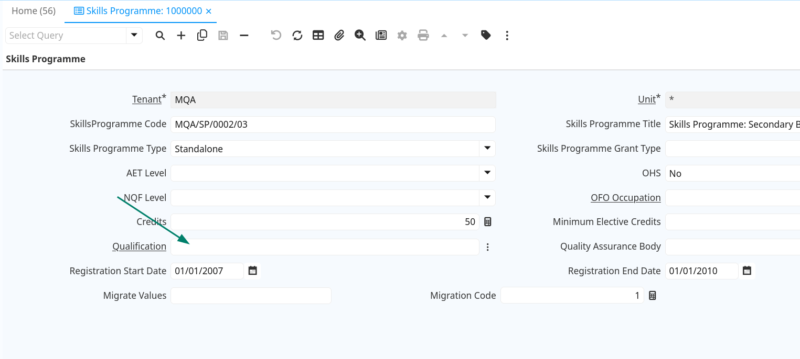
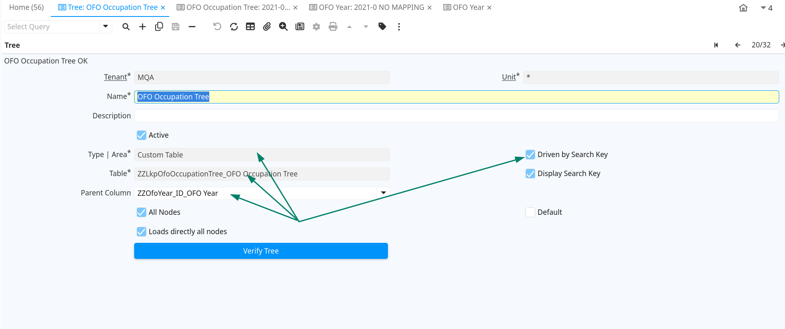
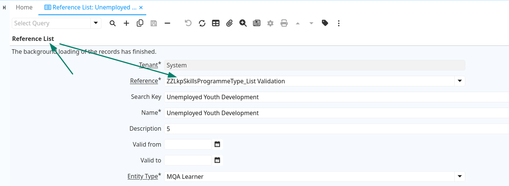
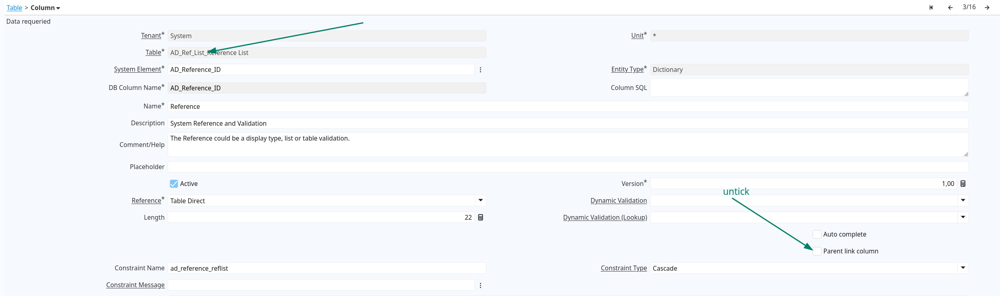

## Migrate stragtegy (Learnership as example)

start with bussiness table like table Learnership

<details>

<summary>Learnership DDL</summary>

```sql
CREATE TABLE MQA.dbo.Learnership (
	ID int IDENTITY(1,1) NOT NULL,
	LearnershipCode nvarchar(50) COLLATE SQL_Latin1_General_CP1_CI_AS NOT NULL,
	LearnershipTitle nvarchar(250) COLLATE SQL_Latin1_General_CP1_CI_AS NOT NULL,
	LearnershipTypeId int NOT NULL,
	QualificationID int NULL,
	NQFLevelID int NOT NULL,
	Credits int NOT NULL,
	QualityAssuranceBodyID int NOT NULL,
	OFOOccupationID int NOT NULL,
	RegistrationStartDate datetime NOT NULL,
	RegistrationEndDate datetime NOT NULL,
	DateCreated datetime NOT NULL,
	CreatedBy int NOT NULL,
	DateUpdated datetime NOT NULL,
	UpdatedBy int NOT NULL,
	IsDeleted tinyint NOT NULL,
	MigrationRecordID int NULL,
	MinimumElectiveCredits int NULL,
	SysStartTime datetime2 DEFAULT sysutcdatetime() NOT NULL,
	SysEndTime datetime2 DEFAULT CONVERT([datetime2],'9999-12-31 23:59:59.9999999') NOT NULL,
	CONSTRAINT PK_Learnership PRIMARY KEY (ID)
);
```

</details>

<details>

<summary>Step to migrate data</summary>

1. on idempiere create table ZZLearnership with standard column
2. for each columns investigate it's reference or not

   1. in case reference table isn't much records and have only code/title column then create it on idempiere as a reference list store id to description column to use later
   2. in case reference table have a lot record or more columns then make it as separate table add column ZZMigrationCode to store id
3. import old data

   1. open window of ZZLearnership input a record and export it to csv to get template (after that delete the record)
   2. build a query data on old database with bellow note
   3. direct value like LearnershipTitle, LearnershipCode just direct query it

      `ls.LearnershipTitle as ZZLearnershipTitle,`
   4. value convert to YES/NO or a build in list of idempiere then use case/when

   `CASE ls.IsDeleted WHEN 0 THEN 'Y' WHEN 1 THEN 'N' END AS IsActive`

   3. easy workaround to fix data

   `CASE when qab.saqacode is null or qab.saqacode = 'N/A' THEN CAST(qab.id as nvarchar(250)) ELSE qab.saqacode END AS ZZQualityAssuranceBody`

   4. reference column that reference table migrate to ad_reference, so query code and idempiere can help on lookup id when import

   `lev.SAQACode as ZZNqfLevel,`

   5. reference table has column is unique value so idempiere can be help to lookup id when import

   `q.SAQAQualificationID as "ZZQualification_ID[ZZSaqaQualificationCode]",`

   6. reference columns hasn't unique value so can't lookup like (5) and (4) then save id to ZZMigrateValues (for post process by sql function zzApplyMigrateValues)

      1. case one column

         `'ZZLkpOfoOccupation:ZZLkpOfoOccupation_id:' + CAST(ooc.id as NVARCHAR(12)) as ZZMigrateValues`
      2. case multi columns

         ```sql
			CONCAT_WS (';',
				'ZZLkpOfoOccupation:ZZLkpOfoOccupation_id:' + CAST(ooc.id as NVARCHAR(12)),
				'ZZLkpOfoOccupation:ZZLkpOfoOccupation_id:' + CAST(ooc.id as NVARCHAR(12))
			) as ZZMigrateValues
         ```

</details>

<details>

<summary>Query Learnership</summary>

    ```sql
	SELECT
		'*' as "AD_Org_ID[Name]",
		ls.LearnershipTitle as ZZLearnershipTitle,
		ls.LearnershipCode as ZZLearnershipCode,
		lst.description as ZZLearnershipType,
		q.SAQAQualificationID as "ZZQualification_ID[ZZSaqaQualificationCode]",
		lev.SAQACode as ZZNqfLevel,
		ls.Credits as ZZCredits,
		CASE when qab.saqacode is null or qab.saqacode = 'N/A' THEN CAST(qab.id as nvarchar(250)) ELSE qab.saqacode END AS ZZQualityAssuranceBody,
		ls.Registrationstartdate as Registrationstartdate,
		ls.Registrationenddate as Registrationenddate,
		ls.MinimumElectiveCredits AS ZZMinimumElectiveCredits,
		CASE ls.IsDeleted WHEN 0 THEN 'Y' WHEN 1 THEN 'N' END AS IsActive,
		ls.id as "ZZMigrationCode/K",
		'ZZLkpOfoOccupation:ZZLkpOfoOccupation_id:' + CAST(ooc.id as NVARCHAR(12)) as ZZMigrateValues -- ooc.id null then result is null

    --CONCAT_WS (';',
		--	'ZZLkpOfoOccupation:ZZLkpOfoOccupation_id' + CAST(ooc.id as NVARCHAR(12)), -- ooc.id is null then this line is null and get out from expression
		--	'ZZLkpOfoOccupation:ZZLkpOfoOccupation_id' + CAST(ooc.id as NVARCHAR(12))
		--) as ZZMigrateValues

    FROM
		Learnership ls
		left join lkpNQFLevel lev on ls.NQFLevelID = lev.id
		left join Qualification q on ls.QualificationID = q.ID
		left join lkpLearnershipType lst on ls.LearnershipTypeId = lst.ID
		left join LkpOfoOccupation ooc on ls.OFOOccupationID = ooc.ID
		left join lkpQualityAssuranceBody qab on ls.QualityAssuranceBodyID = qab.ID
	```

</details>

4. export result of query learnership to csv and import to window learnership
5. in case not yet create/update sql function zzApplyMigrateValues then run file [zzApplyMigrateValues.sql](zzApplyMigrateValues.sql)
6. parse ZZMigrateValues and lookup reference id to update to table learnership by run sql function

   `SELECT zzApplyMigrateValues('ZZLearnership');`

## Some case need to attendent

1. reference to a inactive record on reference table

   

   SkillsProgram reference to Qualification but some record Qualification is inactive so it not show also can't lookup when do import

   1. solution 1: use ZZMigrateValues
   2. solution 2: define ad_reference with Table Validation and choose Show Inactive = yes
2. reference to a inactive record on ad_reference table

solution: use ZZMigrateValues

## Global validate unique data

### lkpAETLevel
<details>

<summary>lkpAETLevel validate</summary>

```sql
-- find unique column select * from lkpAETLevel
select count(*) as total
	, COUNT(CASE WHEN IsDeleted = 0 THEN 1 END) as ActiveCount
	, count(DISTINCT(description)) as totalDescDistinct
	, COUNT(DISTINCT CASE WHEN IsDeleted = 0 THEN description END) AS "Desc"
	, count(DISTINCT(saqaCode)) as totalSaqaCodeDistinct
	, COUNT(DISTINCT CASE WHEN IsDeleted = 0 THEN saqaCode END) AS SaqaCode
from lkpAETLevel;
-- q&a saqaCode is empty on all record so use description for it
-- list duplicate values
select description from lkpAETLevel where IsDeleted = 0 group by description having COUNT (*) > 1;
select saqaCode from lkpAETLevel where IsDeleted = 0 group by saqaCode having COUNT (*) > 1;

-- #### lkpNQFLevel
-- find unique column select * from lkpNQFLevel
select count(*) as total
	, COUNT(CASE WHEN IsDeleted = 0 THEN 1 END) as ActiveCount
	, count(DISTINCT(description)) as totalDescDistinct
	, COUNT(DISTINCT CASE WHEN IsDeleted = 0 THEN description END) AS "Desc"
	, count(DISTINCT(saqaCode)) as totalSaqaCodeDistinct
	, COUNT(DISTINCT CASE WHEN IsDeleted = 0 THEN saqaCode END) AS SaqaCode
from lkpNQFLevel;

-- list duplicate values
select description from lkpNQFLevel where IsDeleted = 0 group by description having COUNT (*) > 1;
select saqaCode from lkpNQFLevel where IsDeleted = 0 group by saqaCode having COUNT (*) > 1;

-- list all values
select DISTINCT description from lkpNQFLevel;
select DISTINCT saqaCode from lkpNQFLevel;
```

</details>


### lkpLearnershipType
<details>

<summary>lkpLearnershipType validate</summary>

```sql
-- #### lkpLearnershipType
-- find unique column select * from lkpLearnershipType
select count(*) as total
	, COUNT(CASE WHEN IsDeleted = 0 THEN 1 END) as ActiveCount 
	, count(DISTINCT(description)) as totalDescDistinct
	, COUNT(DISTINCT CASE WHEN IsDeleted = 0 THEN description END) AS "Desc"
from lkpLearnershipType;

-- list duplicate values
select description from lkpLearnershipType where IsDeleted = 0 group by description having COUNT (*) > 1;
```

</details>


### LkpOfoOccupation
<details>

<summary>LkpOfoOccupation validate</summary>

```sql
-- ########## LkpOfoOccupation
-- find unique column select * from LkpOfoOccupation
select count(*) as total
	, COUNT(CASE WHEN IsDeleted = 0 THEN 1 END) as ActiveCount
	, count(DISTINCT(description)) as totalDescDistinct
	, COUNT(DISTINCT CASE WHEN IsDeleted = 0 THEN description END) AS "Desc"
	, count(DISTINCT(code)) as totalCodeDistinct
	, COUNT(DISTINCT CASE WHEN IsDeleted = 0 THEN code END) AS Code
	
	, COUNT(DISTINCT CASE WHEN IsDeleted = 0 THEN CONCAT(code, '_', UnitGroupID) END) AS CodeUnitGroupID
	, COUNT(DISTINCT CONCAT(code, '_', UnitGroupID)) AS totalCodeUnitGroupIDDistinct
	, COUNT(DISTINCT CASE WHEN IsDeleted = 0 THEN CONCAT(description, '_', UnitGroupID) END) AS DescUnitGroupID
	, COUNT(DISTINCT CONCAT(description, '_', UnitGroupID)) AS totalDescUnitGroupIDDistinct
from LkpOfoOccupation;
-- q&a choose a LkpOfoOccupation isn't simple it need to be choose by chain
-- choose OFOYear => choose lkpOFOMajorGroup => lkpOFOSubMajorGroup => lkpOFOUnitGroup => LkpOfoOccupation

-- list duplicate values (moment code/desc is unique when combine with UnitGroupID)
select UnitGroupID, Code
from LkpOfoOccupation where IsDeleted = 0 group by UnitGroupID, Code having count(*) > 1;

select UnitGroupID, description
from LkpOfoOccupation where IsDeleted = 0 group by UnitGroupID, description having count(*) > 1;

-- list all values
select UnitGroupID, Code, description
from LkpOfoOccupation where IsDeleted = 0 order by UnitGroupID;

-- check exist deleted reference
select
	COUNT(CASE WHEN ug.IsDeleted = 1 THEN 1 END) as OFOUnitGroupRef
from LkpOfoOccupation Ofo LEFT  join lkpOFOUnitGroup ug on ofo.UnitGroupID = ug.ID 
where Ofo.IsDeleted = 0;

-- check Orphan record
select
	*
from LkpOfoOccupation Ofo LEFT  join lkpOFOUnitGroup ug on ofo.UnitGroupID = ug.ID
where ug.id is null
```

</details>


### lkpOFOUnitGroup
<details>

<summary>lkpOFOUnitGroup validate</summary>

```sql
--########### lkpOFOUnitGroup
-- find unique column select * from lkpOFOUnitGroup
select count(*) as total
	, COUNT(CASE WHEN IsDeleted = 0 THEN 1 END) as ActiveCount
	, count(DISTINCT(description)) as totalDescDistinct
	, COUNT(DISTINCT CASE WHEN IsDeleted = 0 THEN description END) AS "Desc"
	, count(DISTINCT(code)) as totalCodeDistinct
	, COUNT(DISTINCT CASE WHEN IsDeleted = 0 THEN code END) AS Code
	
	, COUNT(DISTINCT CASE WHEN IsDeleted = 0 THEN CONCAT(code, '_', subMajorGroupId) END) AS CodeSubMajorGroupId
	, COUNT(DISTINCT CONCAT(code, '_', SubMajorGroupId)) AS totalCodeSubMajorGroupIdDistinct
	, COUNT(DISTINCT CASE WHEN IsDeleted = 0 THEN CONCAT(description, '_', SubMajorGroupId) END) AS DescSubMajorGroupId
	, COUNT(DISTINCT CONCAT(description, '_', SubMajorGroupId)) AS totalDescSubMajorGroupIdDistinct
from lkpOFOUnitGroup;

-- list duplicate values (moment code/desc is unique when combine with subMajorGroupId)
select subMajorGroupId, Code
from lkpOFOUnitGroup where IsDeleted = 0 group by subMajorGroupId, Code having count(*) > 1;

select subMajorGroupId, description
from lkpOFOUnitGroup where IsDeleted = 0 group by subMajorGroupId, description having count(*) > 1;

-- list all values
select subMajorGroupId, Code, description
from lkpOFOUnitGroup where IsDeleted = 0 order by subMajorGroupId;

-- check exist deleted reference
select
	COUNT(CASE WHEN ug.IsDeleted = 1 THEN 1 END) as OFOSubMajorGroupRef
from lkpOFOUnitGroup ug LEFT join lkpOFOSubMajorGroup sg on ug.SubMajorGroupID = sg.id 
where ug.IsDeleted = 0;

-- check Orphan record
select
	*
from lkpOFOUnitGroup ug LEFT join lkpOFOSubMajorGroup sg on ug.SubMajorGroupID = sg.id 
where sg.id is null
```

</details>


### lkpOFOSubMajorGroup
<details>

<summary>lkpOFOSubMajorGroup validate</summary>

```sql
--########### lkpOFOSubMajorGroup
-- find unique column select * from lkpOFOSubMajorGroup
select count(*) as total
	, COUNT(CASE WHEN IsDeleted = 0 THEN 1 END) as ActiveCount
	, count(DISTINCT(description)) as totalDescDistinct
	, COUNT(DISTINCT CASE WHEN IsDeleted = 0 THEN description END) AS "Desc"
	, count(DISTINCT(code)) as totalCodeDistinct
	, COUNT(DISTINCT CASE WHEN IsDeleted = 0 THEN code END) AS Code
	
	, COUNT(DISTINCT CASE WHEN IsDeleted = 0 THEN CONCAT(code, '_', MajorGroupId) END) AS CodeMajorGroupId
	, COUNT(DISTINCT CONCAT(code, '_', MajorGroupId)) AS totalCodeSubMajorGroupIdDistinct
	, COUNT(DISTINCT CASE WHEN IsDeleted = 0 THEN CONCAT(description, '_', MajorGroupId) END) AS DescMajorGroupId
	, COUNT(DISTINCT CONCAT(description, '_', MajorGroupId)) AS totalDescMajorGroupIdDistinct
from lkpOFOSubMajorGroup;

-- list duplicate values (moment code/desc is unique when combine with MajorGroupId)
select MajorGroupId, Code
from lkpOFOSubMajorGroup where IsDeleted = 0 group by MajorGroupId, Code having count(*) > 1;

select MajorGroupId, description
from lkpOFOSubMajorGroup where IsDeleted = 0 group by MajorGroupId, description having count(*) > 1;

-- list all values
select MajorGroupId, Code, description
from lkpOFOSubMajorGroup where IsDeleted = 0 order by MajorGroupId;

-- check exist deleted reference
select
	COUNT(CASE WHEN mg.IsDeleted = 1 THEN 1 END) as OFOSubMajorGroupRef
from lkpOFOSubMajorGroup sg LEFT join lkpOFOMajorGroup mg on sg.MajorGroupID = mg.id 
where sg.IsDeleted = 0;

-- check Orphan record
select
	*
from lkpOFOSubMajorGroup sg LEFT join lkpOFOMajorGroup mg on sg.MajorGroupID = mg.id
where mg.id is null
```

</details>


### lkpOFOMajorGroup
<details>

<summary>lkpOFOMajorGroup validate</summary>

```sql
--########### lkpOFOMajorGroup
-- find unique column select * from lkpOFOMajorGroup
select count(*) as total
	, COUNT(CASE WHEN IsDeleted = 0 THEN 1 END) as ActiveCount
	, count(DISTINCT(description)) as totalDescDistinct
	, COUNT(DISTINCT CASE WHEN IsDeleted = 0 THEN description END) AS "Desc"
	, count(DISTINCT(code)) as totalCodeDistinct
	, COUNT(DISTINCT CASE WHEN IsDeleted = 0 THEN code END) AS Code
	
	, COUNT(DISTINCT CASE WHEN IsDeleted = 0 THEN CONCAT(code, '_', OFOYear) END) AS CodeOFOYear
	, COUNT(DISTINCT CONCAT(code, '_', OFOYear)) AS totalCodeOFOYearDistinct
	, COUNT(DISTINCT CASE WHEN IsDeleted = 0 THEN CONCAT(description, '_', OFOYear) END) AS DescOFOYear
	, COUNT(DISTINCT CONCAT(description, '_', OFOYear)) AS totalDescOFOYearDistinct
from lkpOFOMajorGroup;

-- list duplicate values (moment code/desc is unique when combine with OFOYear)
select OFOYear, Code
from lkpOFOMajorGroup where IsDeleted = 0 group by OFOYear, Code having count(*) > 1;

select OFOYear, description
from lkpOFOMajorGroup where IsDeleted = 0 group by OFOYear, description having count(*) > 1;

-- list all values
select OFOYear, Code, description
from lkpOFOMajorGroup where IsDeleted = 0 order by OFOYear;

-- check Orphan record
select
	*
from lkpOFOMajorGroup mg
where mg.OFOYear is null

-- #### lkpQualityAssuranceBody
-- find unique column select * from lkpQualityAssuranceBody
select count(*) as total
	, COUNT(CASE WHEN IsDeleted = 0 THEN 1 END) as ActiveCount
	, count(DISTINCT(description)) as totalDescDistinct
	, COUNT(DISTINCT CASE WHEN IsDeleted = 0 THEN description END) AS "Desc"
	, count(DISTINCT(saqaCode)) as totalSaqaCodeDistinct
	, COUNT(DISTINCT CASE WHEN IsDeleted = 0 THEN saqaCode END) AS SaqaCode
from lkpQualityAssuranceBody;
-- q&a saqaCode isn't unique, description is unique
-- use id for saqaCode in non-unique value

-- list duplicate values
select description from lkpQualityAssuranceBody where IsDeleted = 0 group by description having COUNT (*) > 1;
select saqaCode from lkpQualityAssuranceBody where IsDeleted = 0 group by saqaCode having COUNT (*) > 1;

-- list all values
select DISTINCT description from lkpQualityAssuranceBody;
select DISTINCT saqaCode from lkpQualityAssuranceBody;
```

</details>


### lkpQCTOQualificationType
<details>

<summary>lkpQCTOQualificationType validate</summary>

```sql
-- #### lkpQCTOQualificationType
-- find unique column select * from lkpQCTOQualificationType
select count(*) as total
	, COUNT(CASE WHEN IsDeleted = 0 THEN 1 END) as ActiveCount
	, count(DISTINCT(description)) as totalDescDistinct
	, COUNT(DISTINCT CASE WHEN IsDeleted = 0 THEN description END) AS "Desc"
from lkpQCTOQualificationType;

-- list duplicate values
select description from lkpQCTOQualificationType where IsDeleted = 0 group by description having COUNT (*) > 1;

-- list all values
select DISTINCT description from lkpQCTOQualificationType;
```

</details>


### lkpQCTOLearnershipType
<details>

<summary>lkpQCTOLearnershipType validate</summary>

```sql
-- #### lkpQCTOLearnershipType
-- find unique column select * from lkpQCTOLearnershipType
select count(*) as total
	, COUNT(CASE WHEN IsDeleted = 0 THEN 1 END) as ActiveCount
	, count(DISTINCT(description)) as totalDescDistinct
	, COUNT(DISTINCT CASE WHEN IsDeleted = 0 THEN description END) AS "Desc"
from lkpQCTOLearnershipType;

-- list duplicate values
select description from lkpQCTOLearnershipType where IsDeleted = 0 group by description having COUNT (*) > 1;

-- list all values
select DISTINCT description from lkpQCTOLearnershipType;
```

</details>


### lkpSkillsProgrammeType
<details>

<summary>lkpSkillsProgrammeType validate</summary>

```sql
-- #### lkpSkillsProgrammeType
-- find unique column select * from lkpSkillsProgrammeType
select count(*) as total
	, COUNT(CASE WHEN IsDeleted = 0 THEN 1 END) as ActiveCount
	, count(DISTINCT(description)) as totalDescDistinct
	, COUNT(DISTINCT CASE WHEN IsDeleted = 0 THEN description END) AS "Desc"
from lkpSkillsProgrammeType;

-- list duplicate values
select description from lkpSkillsProgrammeType where IsDeleted = 0 group by description having COUNT (*) > 1;

-- list all values
select DISTINCT description from lkpSkillsProgrammeType;
```

</details>

### lkpNQFLevel
<details>

<summary>lkpNQFLevel validate</summary>

```sql
-- #### lkpNQFLevel
-- find unique column select * from lkpAETLevel
select count(*) as total
	, COUNT(CASE WHEN IsDeleted = 0 THEN 1 END) as ActiveCount
	, count(DISTINCT(description)) as totalDescDistinct
	, COUNT(DISTINCT CASE WHEN IsDeleted = 0 THEN description END) AS "Desc"
	, count(DISTINCT(saqaCode)) as totalSaqaCodeDistinct
	, COUNT(DISTINCT CASE WHEN IsDeleted = 0 THEN saqaCode END) AS SaqaCode
from lkpAETLevel;
-- q&a saqaCode is null on all record so use descrition as saqaCode
-- list duplicate values
select description from lkpAETLevel where IsDeleted = 0 group by description having COUNT (*) > 1;
select saqaCode from lkpAETLevel where IsDeleted = 0 group by saqaCode having COUNT (*) > 1;


-- list all values
select DISTINCT description from lkpAETLevel;
select DISTINCT saqaCode from lkpAETLevel;
```

</details>


### lkpLearningType
<details>

<summary>lkpLearningType validate</summary>

```sql
-- #### lkpLearningType
-- find unique column select * from lkpLearningType
select count(*) as total
	, COUNT(CASE WHEN IsDeleted = 0 THEN 1 END) as ActiveCount
	, count(DISTINCT(description)) as totalDescDistinct
	, COUNT(DISTINCT CASE WHEN IsDeleted = 0 THEN description END) AS "Desc"
	, count(DISTINCT(saqaCode)) as totalSaqaCodeDistinct
	, COUNT(DISTINCT CASE WHEN IsDeleted = 0 THEN saqaCode END) AS SaqaCode
from lkpLearningType;
-- q&a saqaCode is null on all record so use descrition as saqaCode
-- list duplicate values
select description from lkpLearningType where IsDeleted = 0 group by description having COUNT (*) > 1;
select saqaCode from lkpLearningType where IsDeleted = 0 group by saqaCode having COUNT (*) > 1;


-- list all values
select DISTINCT description from lkpLearningType;
select DISTINCT saqaCode from lkpLearningType;
```

</details>


### lkpModuleType
<details>

<summary>lkpModuleType validate</summary>

```sql
-- #### lkpModuleType
-- find unique column select * from lkpModuleType
select count(*) as total
	, COUNT(CASE WHEN IsDeleted = 0 THEN 1 END) as ActiveCount
	, count(DISTINCT(description)) as totalDescDistinct
	, COUNT(DISTINCT CASE WHEN IsDeleted = 0 THEN description END) AS "Desc"
	, count(DISTINCT(saqaCode)) as totalSaqaCodeDistinct
	, COUNT(DISTINCT CASE WHEN IsDeleted = 0 THEN saqaCode END) AS SaqaCode
from lkpModuleType;

-- list duplicate values
select description from lkpModuleType where IsDeleted = 0 group by description having COUNT (*) > 1;
select saqaCode from lkpModuleType where IsDeleted = 0 group by saqaCode having COUNT (*) > 1;
-- q&a saqaCode is null on all record so use descrition as saqaCode

-- list all values
select DISTINCT description from lkpModuleType;
select DISTINCT saqaCode from lkpModuleType;
```

</details>


### lkpSkillsProgrammeGrantType
<details>

<summary>lkpSkillsProgrammeGrantType validate</summary>

```sql
-- #### lkpSkillsProgrammeGrantType => no value at all
-- find unique column select * from lkpSkillsProgrammeGrantType
select count(*) as total
	, COUNT(CASE WHEN IsDeleted = 0 THEN 1 END) as ActiveCount
	, count(DISTINCT(description)) as totalDescDistinct
	, COUNT(DISTINCT CASE WHEN IsDeleted = 0 THEN description END) AS "Desc"
from lkpSkillsProgrammeGrantType;

-- list duplicate values
select description from lkpSkillsProgrammeGrantType where IsDeleted = 0 group by description having COUNT (*) > 1;

-- list all values
select DISTINCT description from lkpSkillsProgrammeGrantType;
```

</details>


### lkpQualificationType
<details>

<summary>lkpQualificationType validate</summary>

```sql
-- #### lkpQualificationType
-- find unique column select * from lkpQualificationType
select count(*) as total
	, COUNT(CASE WHEN IsDeleted = 0 THEN 1 END) as ActiveCount
	, count(DISTINCT(description)) as totalDescDistinct
	, COUNT(DISTINCT CASE WHEN IsDeleted = 0 THEN description END) AS "Desc"
from lkpQualificationType;

-- list duplicate values
select description from lkpQualificationType where IsDeleted = 0 group by description having COUNT (*) > 1;

-- list all values
select DISTINCT description from lkpQualificationType;
```

</details>


### Qualification
<details>

<summary>Qualification validate</summary>

```sql
-- ###### Qualification
-- find unique column select * from Qualification
select count(*) as total
	, COUNT(CASE WHEN IsDeleted = 0 THEN 1 END) as ActiveCount 
	, count(DISTINCT(SAQAQualificationID)) as totalSAQAQualificationIDDistinct
	, COUNT(DISTINCT CASE WHEN IsDeleted = 0 THEN SAQAQualificationID END) AS SAQAQualificationID
	, count(DISTINCT(SAQAQualificationTitle)) as totalSAQAQualificationTitleDistinct
	, COUNT(DISTINCT CASE WHEN IsDeleted = 0 THEN SAQAQualificationTitle END) AS SAQAQualificationTitle
from Qualification
--Q&A SAQAQualificationTitle isn't unique so when display on list user can be confuse

-- list duplicate values
select SAQAQualificationID from Qualification where IsDeleted = 0 group by SAQAQualificationID having COUNT (*) > 1;
select SAQAQualificationTitle from Qualification where IsDeleted = 0 group by SAQAQualificationTitle having COUNT (*) > 1;
-- list all values
select DISTINCT SAQAQualificationID from Qualification where IsDeleted = 0;
select DISTINCT SAQAQualificationTitle from Qualification where IsDeleted = 0;

-- list ReplacementQualificationID
select ReplacementQualificationID, IsDeleted, IsReplacement  from Qualification where ReplacementQualificationID is not null
--q&a some ReplacementQualificationID = 0 what's meaning because id is start from 1
select * from Qualification where IsReplacement = '1';

-- check exist deleted reference
SELECT
	COUNT(CASE WHEN lev.IsDeleted = 1 THEN 1 END) as NQFLevelRef
	, COUNT(CASE WHEN qab.IsDeleted = 1 THEN 1 END) as QualityAssuranceBodyRef
	, COUNT(CASE WHEN qt.IsDeleted = 1 THEN 1 END) as QualificationTypeRef
	, COUNT(CASE WHEN rq.IsDeleted = 1 THEN 1 END) as ReplacementQualificationRef
	, COUNT(CASE WHEN ooc.IsDeleted = 1 THEN 1 END) as OfoOccupationRef
FROM 
	Qualification q 
	left join lkpNQFLevel lev on q.NQFLevelID = lev.id
	left join lkpQualityAssuranceBody qab on q.QualityAssuranceBodyID = qab.ID
	left join lkpQualificationType qt on q.QualificationTypeId = qt.ID 
	left join Qualification rq on q.ReplacementQualificationID = rq.ID 
	left join LkpOfoOccupation ooc on q.OFOOccupationID = ooc.ID
where q.IsDeleted = '0'
```

</details>


### QCTOQualification
<details>

<summary>QCTOQualification validate</summary>

```sql
-- ###### QCTOQualification
-- find unique column select * from QCTOQualification
select count(*) as total
	, COUNT(CASE WHEN IsDeleted = 0 THEN 1 END) as ActiveCount 
	, count(DISTINCT(SAQAQualificationID)) as totalSAQAQualificationIDDistinct
	, COUNT(DISTINCT CASE WHEN IsDeleted = 0 THEN SAQAQualificationID END) AS activeSAQAQualificationID	
	, count(DISTINCT(SAQAQualificationTitle)) as totalSAQAQualificationTitle
	, COUNT(DISTINCT CASE WHEN IsDeleted = 0 THEN SAQAQualificationTitle END) AS activeSAQAQualificationTitle
from QCTOQualification
--Q&A SAQAQualificationTitle isn't unique so when display on list user can be confuse
-- list duplicate values
select SAQAQualificationID from QCTOQualification where IsDeleted = 0 group by SAQAQualificationID having COUNT (*) > 1;
select SAQAQualificationTitle from QCTOQualification where IsDeleted = 0 group by SAQAQualificationTitle having COUNT (*) > 1;

-- check reference  ReplacementQualificationID  (exist one Replacement)
select ReplacementQualificationID, IsDeleted, IsReplacement from QCTOQualification where ReplacementQualificationID is not null;

-- check exist Replacement
select rqq.IsDeleted, qq.IsDeleted 
from QCTOQualification rqq inner JOIN QCTOQualification qq on qq.ReplacementQualificationID = rqq.ID where qq.ReplacementQualificationID is not null;

-- check reference to deleted record
select q.IsDeleted, qq.IsDeleted
from Qualification q inner JOIN QCTOQualification qq on qq.QualificationID = q.ID 
where qq.QualificationID is not null and q.IsDeleted = 1;
-- * exists case reference to a inactive record

-- select list of static value (moment 1 and 2)
SELECt DISTINCT ArtisanQualificationYesNoID from QCTOQualification where IsDeleted = 0;

-- verify ArtisanQualificationYesNoID  isn't relate QualificationID
select DISTINCT qq.ArtisanQualificationYesNoID, qq.QualificationID
from QCTOQualification qq group by qq.ArtisanQualificationYesNoID, qq.QualificationID;

-- check exist deleted reference (exist for Qualification and ReplacementQualification)
SELECT 
	COUNT(CASE WHEN lev.IsDeleted = 1 THEN 1 END) as NQFLevelRef
	, COUNT(CASE WHEN qqt.IsDeleted = 1 THEN 1 END) as QCTOQualificationTypeRef
	, COUNT(CASE WHEN rq.IsDeleted = 1 THEN 1 END) as ReplacementQualificationRef
	, COUNT(CASE WHEN q.IsDeleted = 1 THEN 1 END) as QualificationRef
	, COUNT(CASE WHEN ooc.IsDeleted = 1 THEN 1 END) as OfoOccupationRef
FROM
	QCTOQualification qq
	left join lkpNQFLevel lev on qq.NQFLevelID = lev.id
	left join lkpQCTOQualificationType qqt on qq.QCTOQualificationTypeId = qqt.ID
	left join Qualification rq on qq.QualificationID = rq.ID
	left join Qualification q on qq.QualificationID = q.ID
	left join LkpOfoOccupation ooc on qq.OFOOccupationID = ooc.ID
where qq.IsDeleted = '0'
```

</details>


### QCTOLearnership
<details>

<summary>QCTOLearnership validate</summary>

```sql
-- ###### QCTOLearnership
-- find unique column select * from QCTOLearnership
select count(*) as total
	, COUNT(CASE WHEN IsDeleted = 0 THEN 1 END) as ActiveCount 
	, count(DISTINCT(LearnershipCode)) as totalLearnershipDistinct
	, COUNT(DISTINCT CASE WHEN IsDeleted = 0 THEN LearnershipCode END) AS activeLearnershipCode
	, count(DISTINCT(LearnershipTitle)) as totalLearnershipTitle
	, COUNT(DISTINCT CASE WHEN IsDeleted = 0 THEN LearnershipTitle END) AS activeLearnershipTitle
from QCTOLearnership;
--Q&A LearnershipTitle isn't unique so when display on list user can be confuse
-- list duplicate values
select LearnershipCode from QCTOLearnership where IsDeleted = 0 group by LearnershipCode having COUNT (*) > 1;
select LearnershipTitle from QCTOLearnership where IsDeleted = 0 group by LearnershipTitle having COUNT (*) > 1;

-- check deleted reference (exists for Qualification)
SELECT
	COUNT(CASE WHEN lev.IsDeleted = 1 THEN 1 END) as NQFLevelRef
	, COUNT(CASE WHEN q.IsDeleted = 1 THEN 1 END) as QualificationRef
	, COUNT(CASE WHEN qlst.IsDeleted = 1 THEN 1 END) as QCTOLearnershipTypeRef
	, COUNT(CASE WHEN ooc.IsDeleted = 1 THEN 1 END) as OfoOccupationRef
FROM 
	QCTOLearnership qls 
	left join lkpNQFLevel lev on qls.NQFLevelID = lev.id
	left join Qualification q on qls.QualificationID = q.ID 
	left join lkpQCTOLearnershipType qlst on qls.QCTOLearnershipTypeId = qlst.ID 
	left join LkpOfoOccupation ooc on qls.OFOOccupationID = ooc.ID
where qls.IsDeleted = '0'
```

</details>

### QCTOSkillsProgramme
<details>

<summary>QCTOSkillsProgramme validate</summary>

```sql
-- ###### QCTOSkillsProgramme
-- find unique column select * from QCTOSkillsProgramme
select count(*) as total
	, COUNT(CASE WHEN IsDeleted = 0 THEN 1 END) as ActiveCount 
	, count(DISTINCT(SkillsProgrammeCode)) as totalSkillsProgrammeCodeDistinct
	, COUNT(DISTINCT CASE WHEN IsDeleted = 0 THEN SkillsProgrammeCode END) AS activeSkillsProgrammeCode
	, count(DISTINCT(SkillsProgrammeTitle)) as totalSkillsProgrammeTitle
	, COUNT(DISTINCT CASE WHEN IsDeleted = 0 THEN SkillsProgrammeTitle END) AS activeSkillsProgrammeTitle
from QCTOSkillsProgramme;
-- list duplicate values
select SkillsProgrammeCode from QCTOSkillsProgramme where IsDeleted = 0 group by SkillsProgrammeCode having COUNT (*) > 1;
select SkillsProgrammeTitle from QCTOSkillsProgramme where IsDeleted = 0 group by SkillsProgrammeTitle having COUNT (*) > 1;

-- check deleted reference (exists for Qualification)
SELECT
	COUNT(CASE WHEN lev.IsDeleted = 1 THEN 1 END) as NQFLevelRef
	, COUNT(CASE WHEN q.IsDeleted = 1 THEN 1 END) as QualificationRef
	, COUNT(CASE WHEN ooc.IsDeleted = 1 THEN 1 END) as OfoOccupationRef
	, COUNT(CASE WHEN qab.IsDeleted = 1 THEN 1 END) as QualityAssuranceBodyRef
	, COUNT(CASE WHEN lspt.IsDeleted = 1 THEN 1 END) as SkillsProgrammeTypeRef
	, COUNT(CASE WHEN al.IsDeleted = 1 THEN 1 END) as AETLevelRef
	, COUNT(CASE WHEN spgt.IsDeleted = 1 THEN 1 END) as AETLevelRef
FROM 
	QCTOSkillsProgramme qsp 
	left join lkpNQFLevel lev on qsp.NQFLevelID = lev.id
	left join Qualification q on qsp.QualificationID = q.ID 
	left join LkpOfoOccupation ooc on qsp.OFOOccupationID = ooc.ID
	left join lkpQualityAssuranceBody qab on qsp.QualityAssuranceBodyID = qab.ID
	left join lkpSkillsProgrammeType lspt on qsp.SkillsProgrammeTypeID = lspt.id
	left join lkpAETLevel al on qsp.AETLevelID = al.id
	left join lkpSkillsProgrammeGrantType spgt on qsp.SkillsProgrammeGrantTypeID = spgt.id
where
	qsp.IsDeleted = '0'
```

</details>

### SkillsProgramme
<details>

<summary>SkillsProgramme validate</summary>

```sql
-- ###### SkillsProgramme
-- find unique column select * from SkillsProgramme
select count(*) as total
	, COUNT(CASE WHEN IsDeleted = 0 THEN 1 END) as ActiveCount 
	, count(DISTINCT(SkillsProgrammeCode)) as totalSkillsProgrammeCodeDistinct
	, COUNT(DISTINCT CASE WHEN IsDeleted = 0 THEN SkillsProgrammeCode END) AS activeSkillsProgrammeCode
	, count(DISTINCT(SkillsProgrammeTitle)) as totalSkillsProgrammeTitle
	, COUNT(DISTINCT CASE WHEN IsDeleted = 0 THEN SkillsProgrammeTitle END) AS activeSkillsProgrammeTitle
from SkillsProgramme;
-- q&a SkillsProgrammeTitle and SkillsProgrammeCode both not unique
-- list duplicate values
select SkillsProgrammeCode from SkillsProgramme where IsDeleted = 0 group by SkillsProgrammeCode having COUNT (*) > 1;
select SkillsProgrammeTitle from SkillsProgramme where IsDeleted = 0 group by SkillsProgrammeTitle having COUNT (*) > 1;

-- check deleted reference (exists for Qualification)
SELECT
	COUNT(CASE WHEN lev.IsDeleted = 1 THEN 1 END) as NQFLevelRef
	, COUNT(CASE WHEN q.IsDeleted = 1 THEN 1 END) as QualificationRef
	, COUNT(CASE WHEN al.IsDeleted = 1 THEN 1 END) as AETLevelRef
	, COUNT(CASE WHEN ooc.IsDeleted = 1 THEN 1 END) as OfoOccupationRef
	, COUNT(CASE WHEN spgt.IsDeleted = 1 THEN 1 END) as SkillsProgrammeGrantTypeRef
	, COUNT(CASE WHEN lspt.IsDeleted = 1 THEN 1 END) as SkillsProgrammeTypeRef
	, COUNT(CASE WHEN qab.IsDeleted = 1 THEN 1 END) as QualityAssuranceBodyRef
FROM 
	SkillsProgramme sp 
	left join lkpNQFLevel lev on sp.NQFLevelID = lev.id
	left join Qualification q on sp.QualificationID = q.ID 
	left join lkpAETLevel al on sp.AETLevelID = al.id
	left join LkpOfoOccupation ooc on sp.OFOOccupationID = ooc.ID
	left join lkpSkillsProgrammeGrantType spgt on sp.SkillsProgrammeGrantTypeID = spgt.id
	left join lkpSkillsProgrammeType lspt on sp.SkillsProgrammeTypeID = lspt.id
	left join lkpQualityAssuranceBody qab on sp.QualityAssuranceBodyID = qab.ID
WHERE
	sp.IsDeleted = '0'
```

</details>


### QCTOLearnershipModule
<details>

<summary>QCTOLearnershipModule validate</summary>

```sql
-- ###### QCTOLearnershipModule
-- find unique column select * from QCTOLearnershipModule
select 
	QCTOLearnershipid, QCTOModuleID 
from QCTOLearnershipModule lsm
where lsm.IsDeleted = '0'
group by QCTOLearnershipid, QCTOModuleID
having count (*) > 1;
-- moment unique by QCTOLearnershipid, QCTOModuleID

-- check deleted reference (exists for QCTOLearnership)
SELECT
	COUNT(CASE WHEN ql.IsDeleted = 1 THEN 1 END) as QCTOLearnershipRef
	, COUNT(CASE WHEN qm.IsDeleted = 1 THEN 1 END) as QCTOModuleRef
	, COUNT(CASE WHEN mt.IsDeleted = 1 THEN 1 END) as ModuleTypeRef
FROM 
	QCTOLearnershipModule qlm 
	left join QCTOLearnership ql on qlm.QCTOLearnershipID = ql.ID 
	left join QCTOModule qm on qlm.QCTOModuleID = qm.ID 
	left join lkpModuleType mt on qlm.ModuleTypeID = mt.ID 
where 
	qlm.IsDeleted = '0'
```

</details>

### QCTOModule
<details>

<summary>QCTOModule validate</summary>

```sql
-- ###### QCTOModule
-- find unique column select * from QCTOModule
select count(*) as total
	, COUNT(CASE WHEN IsDeleted = 0 THEN 1 END) as ActiveCount 
	, count(DISTINCT(ModuleCode)) as totalModuleCodeDistinct
	, COUNT(DISTINCT CASE WHEN IsDeleted = 0 THEN ModuleCode END) AS activeModuleCode
	, count(DISTINCT(ModuleTitle)) as totalModuleTitle
	, COUNT(DISTINCT CASE WHEN IsDeleted = 0 THEN ModuleTitle END) AS activeModuleTitle
from QCTOModule;
-- q&a modulettile isn't unque
-- list duplicate values
select ModuleCode from QCTOModule where IsDeleted = 0 group by ModuleCode having COUNT (*) > 1;
select ModuleTitle from QCTOModule where IsDeleted = 0 group by ModuleTitle having COUNT (*) > 1;

-- check deleted reference
SELECT
	COUNT(CASE WHEN lev.IsDeleted = 1 THEN 1 END) as NQFLevelRef
	, COUNT(CASE WHEN qab.IsDeleted = 1 THEN 1 END) as QualityAssuranceBodyRef
	, COUNT(CASE WHEN ooc.IsDeleted = 1 THEN 1 END) as LearningTypeRef
	, COUNT(CASE WHEN lt.IsDeleted = 1 THEN 1 END) as OfoOccupationRef
	, COUNT(CASE WHEN mt.IsDeleted = 1 THEN 1 END) as ModuleTypeRef
	
FROM 
	QCTOModule qm 
	left join lkpNQFLevel lev on qm.NQFLevelID = lev.id
	left join lkpQualityAssuranceBody qab on qm.QualityAssuranceBodyID = qab.ID
	left join LkpOfoOccupation ooc on qm.OFOOccupationID = ooc.ID
	left join lkpLearningType lt on qm.LearningTypeID = lt.ID 
	left join lkpModuleType mt ON qm.ModuleTypeID = mt.ID 
where
	qm.IsDeleted = '0'
```

</details>

### Module
<details>

<summary>Module validate</summary>

```sql
-- ###### Module
-- find unique column select * from Module
select count(*) as total
	, COUNT(CASE WHEN IsDeleted = 0 THEN 1 END) as ActiveCount 
	, count(DISTINCT(ModuleCode)) as totalModuleCodeDistinct
	, COUNT(DISTINCT CASE WHEN IsDeleted = 0 THEN ModuleCode END) AS activeModuleCode
	, count(DISTINCT(ModuleTitle)) as totalModuleTitle
	, COUNT(DISTINCT CASE WHEN IsDeleted = 0 THEN ModuleTitle END) AS activeModuleTitle
from Module;
-- q&a both ModuleCode and ModuleTitle isn't unique
 -- list duplicate values
select ModuleCode from Module where IsDeleted = 0 group by ModuleCode having COUNT (*) > 1;
select ModuleTitle from Module where IsDeleted = 0 group by ModuleTitle having COUNT (*) > 1;

-- check deleted reference
SELECT
	COUNT(CASE WHEN qab.IsDeleted = 1 THEN 1 END) as QualityAssuranceBodyRef
	
FROM 
	Module m 
	left join lkpQualityAssuranceBody qab on m.QualityAssuranceBodyID = qab.ID
where
	m.IsDeleted = '0'
```

</details>


## QCTOModule

<details>

<summary>QCTOModule DDL</summary>

```sql
CREATE TABLE MQA.dbo.QCTOModule (
	ID int IDENTITY(1,1) NOT NULL,
	ModuleCode nvarchar(50) COLLATE SQL_Latin1_General_CP1_CI_AS NOT NULL,
	ModuleTitle nvarchar(250) COLLATE SQL_Latin1_General_CP1_CI_AS NOT NULL,
	QualityAssuranceBodyID int NULL,
	Credits int NOT NULL,
	RegistrationStartDate datetime NOT NULL,
	RegistrationEndDate datetime NOT NULL,
	LastEnrolmentDate datetime NOT NULL,
	LastAchievementDate datetime NOT NULL,
	NQFLevelID int NOT NULL,
	LearningTypeID int NOT NULL,
	ModuleTypeID int NOT NULL,
	OFOOccupationID int NULL,
	DateCreated datetime NOT NULL,
	CreatedBy int NOT NULL,
	DateUpdated datetime NOT NULL,
	UpdatedBy int NOT NULL,
	IsDeleted tinyint NOT NULL,
	SysStartTime datetime2 DEFAULT sysutcdatetime() NOT NULL,
	SysEndTime datetime2 DEFAULT CONVERT([datetime2],'9999-12-31 23:59:59.9999999') NOT NULL,
	CONSTRAINT PK_QCTOModule PRIMARY KEY (ID)
);
```

</details>

<details>

<summary>validate data</summary>

</details>

<details>

<summary>QCTOModule Query</summary>

```sql
SELECT
	'*' as "AD_Org_ID[Name]"
	, qm.id as "ZZMigrationCode/K"
	, CASE qm.IsDeleted WHEN 0 THEN 'Y' WHEN 1 THEN 'N' END AS IsActive
	, qm.ModuleCode as ZZModuleCode
	, qm.ModuleTitle as ZZModuleTitle
	, qm.Credits as ZZCredits
	, qm.Registrationstartdate as Registrationstartdate
	, qm.Registrationenddate as Registrationenddate
	, qm.LastEnrolmentDate AS ZZLastEnrolmentDate
	, qm.LastAchievementDate as ZZLastAchievementDate
	, CONCAT_WS (';',
         		'ZZLkpOfoOccupationTree:ZZLkpOfoOccupationTree_ID:ZZLkpOfoOccupationTree_ID:' + CAST(ooc.id as NVARCHAR(12))
         		, 'ref:ZZLkpNqfLevel:ZZNqfLevel:' + CAST(lev.id as NVARCHAR(12))
         		, 'ref:ZZLkpQualityAssuranceBody:ZZQualityAssuranceBody:' + CAST(qab.id as NVARCHAR(12))
         		, 'ref:ZZLkpLearningType:ZZLearningType:' + CAST(lt.id as NVARCHAR(12))
         		, 'ref:ZZLkpModuleType:ZZModuleType:' + CAST(mt.id as NVARCHAR(12))
         	) as ZZMigrateValues

FROM 
	QCTOModule qm 
	left join lkpNQFLevel lev on qm.NQFLevelID = lev.id
	left join lkpQualityAssuranceBody qab on qm.QualityAssuranceBodyID = qab.ID
	left join LkpOfoOccupation ooc on qm.OFOOccupationID = ooc.ID
	left join lkpLearningType lt on qm.LearningTypeID = lt.ID 
	left join lkpModuleType mt ON qm.ModuleTypeID = mt.ID 
```

</details>

<details>

<summary>Q&A</summary>

</details>

### QCTOSkillsProgrammeModule
<details>

<summary>QCTOSkillsProgrammeModule validate</summary>

```sql
-- ###### QCTOSkillsProgrammeModule
-- find unique column select * from QCTOSkillsProgrammeModule
select 
	QCTOSkillsProgrammeID, QCTOModuleID 
from QCTOSkillsProgrammeModule lsm
where lsm.IsDeleted = '0'
group by QCTOSkillsProgrammeID, QCTOModuleID
having count (*) > 1;
-- moment unique by QCTOSkillsProgrammeID, QCTOModuleID

-- check deleted reference
SELECT
	COUNT(CASE WHEN qsp.IsDeleted = 1 THEN 1 END) as QCTOSkillsProgrammeRef
	, COUNT(CASE WHEN qm.IsDeleted = 1 THEN 1 END) as QCTOModuleRef
	, COUNT(CASE WHEN mt.IsDeleted = 1 THEN 1 END) as ModuleTypeRef
FROM 
	QCTOSkillsProgrammeModule qspm 
	left join QCTOSkillsProgramme qsp on qspm.QCTOSkillsProgrammeID = qsp.ID 
	left join QCTOModule qm on qspm.QCTOModuleID = qm.ID 
	left join lkpModuleType mt on qspm.ModuleTypeID = mt.ID 
WHERE
	qspm.IsDeleted = '0'
```

</details>

### UnitStandard
<details>

<summary>UnitStandard validate</summary>

```sql
-- ###### UnitStandard
-- find unique column SELECT * FROM UnitStandard
select count(*) as total
	, COUNT(CASE WHEN IsDeleted = 0 THEN 1 END) as ActiveCount 
	, count(DISTINCT(SAQAUnitStandardID)) as totalSAQAUnitStandardID
	, COUNT(DISTINCT CASE WHEN IsDeleted = 0 THEN SAQAUnitStandardID END) AS activeSAQAUnitStandardID
	, count(DISTINCT(SAQAUnitStandardTitle)) as totalSAQAUnitStandardTitle
	, COUNT(DISTINCT CASE WHEN IsDeleted = 0 THEN SAQAUnitStandardTitle END) AS activeSAQAUnitStandardTitle
	, count(DISTINCT(MQAUnitStandardID)) as totalMQAUnitStandardID
	, COUNT(DISTINCT CASE WHEN IsDeleted = 0 THEN MQAUnitStandardID END) AS activeMQAUnitStandardID
	
from UnitStandard;
-- q&a SAQAUnitStandardID, SAQAUnitStandardTitle, MQAUnitStandardID all isn't unque

-- list duplicate values
select SAQAUnitStandardID from UnitStandard where IsDeleted = 0 group by SAQAUnitStandardID having COUNT (*) > 1;
select SAQAUnitStandardTitle from UnitStandard where IsDeleted = 0 group by SAQAUnitStandardTitle having COUNT (*) > 1;
select MQAUnitStandardID from UnitStandard where IsDeleted = 0 group by MQAUnitStandardID having COUNT (*) > 1;

-- check deleted reference
SELECT
	COUNT(CASE WHEN lev.IsDeleted = 1 THEN 1 END) as NQFLevelRef
	, COUNT(CASE WHEN rus.IsDeleted = 1 THEN 1 END) as ReplacementUnitStandardID
	, COUNT(CASE WHEN qab.IsDeleted = 1 THEN 1 END) as QualityAssuranceBodyRef
FROM
	UnitStandard us
	left join UnitStandard rus on us.ReplacementUnitStandardID = rus.id
	left join lkpNQFLevel lev on us.NQFLevelID = lev.id
	left join lkpQualityAssuranceBody qab on us.QualityAssuranceBodyID = qab.ID
WHERE
	us.IsDeleted = '0'
```

</details>


## LkpOfoOccupation

1. LkpOfoOccupation is special it's tree struct from 5 part
[Explain about ofo](https://www.teta.org.za/index.php/maritime/item/download/80_ae5dcb7dfe8f366c65685b6df7d5d517)

	1. OfoYear like fiscal year (data in same year is unique but on diference years can be duplicate)
	
	2. lkpOFOMajorGroup
	
	3. lkpOFOSubMajorGroup
	
	4. lkpOFOUnitGroup
	
	5. LkpOfoOccupation

2. OFOYear is migrate to ZZOfoYear by bellow query and import to  window "OFO Year"
<details>

<summary>OFOYear query</summary>

```sql
SELECT DISTINCT  
	mg.ofoyear as "ZZOfoYear"
from lkpOFOMajorGroup mg
```

</details>

3. LkpOfoOccupation is migrate to ZZLkpOfoOccupationTree be bellow query, to improve import speed use window "OFO Occupation Tree"
<details>

<summary>LkpOfoOccupation query</summary>

```sql
select 
	mg.ofoyear as "ZZOfoYear_ID[ZZOfoYear]"
	, mg.code AS Value
	, mg.Description  as "Name"
	,mg.id as "ZZMigrationCode"
	, 'Major Group' AS "ZZOfoLevelType"
	, 'Y' as "IsSummary"
from lkpOFOMajorGroup mg

union 

select 
	mg.ofoyear as "ZZOfoYear_ID[ZZOfoYear]"
	, smg.code AS "Value"
	, smg.Description  as "Name"
	, smg.id as "ZZMigrationCode"
	, 'Sub Major Group' AS "ZZOfoLevelType"
	, 'Y' as "IsSummary"
from 
	lkpOFOSubMajorGroup smg
	left join lkpOFOMajorGroup mg on smg.MajorGroupID = mg.ID

UNION
	
select 
	mg.ofoyear as "ZZOfoYear_ID[ZZOfoYear]"
	, ug.code AS "Value"
	, ug.Description  as "Name"
	, ug.id as "ZZMigrationCode"
	, 'Unit Group' AS "ZZOfoLevelType"
	, 'Y' as "IsSummary"
from 
	lkpOFOUnitGroup ug
	left join lkpOFOSubMajorGroup smg on ug.SubMajorGroupID = smg.id
	left join lkpOFOMajorGroup mg on smg.MajorGroupID = mg.ID

UNION 

SELECT 
	mg.ofoyear as "ZZOfoYear_ID[ZZOfoYear]"
	, ofo.code AS "Value"
	, ofo.Description  as "Name"
	, ofo.id as "ZZMigrationCode"
	, null AS "ZZOfoLevelType"
	, 'N' as "IsSummary"
from 
LkpOfoOccupation ofo inner join lkpOFOUnitGroup ug on ofo.UnitGroupID = ug.ID 
inner join lkpOFOSubMajorGroup smg on ug.SubMajorGroupID = smg.id
inner join lkpOFOMajorGroup mg on smg.MajorGroupID = mg.ID 
```

</details>

<details>

<summary>Note</summary>

	1. window OFO Year have 2 tab
		1. OFO Year
		2. OFO Occupation Tree => set have tree = true
	2. on mqa client open tree window and define a "OFO Occupation Tree"

	3. after import remember to run "verify tree"

</details>

## Import other lkp table to ad_reference
'ZZLkpNqfLevel', 'ZZLkpLearnershipType', 'ZZLkpAetLevel', 'ZZLkpQualityAssuranceBody', 'ZZLkpQctoQualificationType', 'ZZLkpQctoLearnershipType', 'ZZLkpSkillsProgrammeType', 'ZZLkpLearningType', 'ZZLkpModuleType', 'ZZLkpSkillsProgrammeGrantType', 'ZZLkpQualificationType'

<details>

<summary>Query for ad_reference and import to reference window</summary>

```sql
WITH NamesCTE AS (
    SELECT * FROM (VALUES 
        ('ZZLkpNqfLevel'),
        ('ZZLkpLearnershipType'),
        ('ZZLkpAetLevel'),
        ('ZZLkpQualityAssuranceBody'),
        ('ZZLkpQctoQualificationType'),
        ('ZZLkpQctoLearnershipType'),
        ('ZZLkpSkillsProgrammeType'),
        ('ZZLkpLearningType'),
        ('ZZLkpModuleType'),
        ('ZZLkpSkillsProgrammeGrantType'),
        ('ZZLkpQualificationType')
        
    ) AS t(Name)
),
DetailsCTE AS (
    SELECT * FROM (VALUES 
        ('MQA Learner', 'L', 'Y')
    ) AS t(EntityType, ValidationType, ShowInactive)
)
SELECT 
    n.Name as "Name/K", 
    n.Name as Description,
    d.EntityType,
    d.ValidationType,
    d.ShowInactive
FROM NamesCTE n
CROSS JOIN DetailsCTE d;
```

</details>

<details>

<summary>query for reference list and import to window Reference List</summary>
to make reference field writeable temp uncheck isParent




```sql
select 
"AD_Reference_ID[Name]\K"
, CASE 
	when value is null or value = 'N/A' THEN CAST(Description as nvarchar(250)) 
	ELSE value END 
AS value
, name
, Description
, EntityType

from
(
-- q&a saqaCode is null on all record so use descrition as saqaCode
select 
	'ZZLkpNqfLevel' as "AD_Reference_ID[Name]\K"
	, description as value
	, description as name
	, id as Description
	, 'MQA Learner' as EntityType
from
	lkpNQFLevel

UNION 
-- no code column so use description for both
select 
	'ZZLkpLearnershipType' as "AD_Reference_ID[Name]\K"
	, description as value
	, description as name
	, id as Description
	, 'MQA Learner' as EntityType
from
	lkpLearnershipType

UNION 

-- q&a saqaCode is empty on all record so use description for both
select 
	'ZZLkpAetLevel' as "AD_Reference_ID[Name]\K"
	, description as value
	, description as name
	, id as Description
	, 'MQA Learner' as EntityType
from
	LkpAetLevel
	
UNION 

-- q&a saqaCode isn't unique, description is unique, use id for case case is null and N/A
select 
	'ZZLkpQualityAssuranceBody' as "AD_Reference_ID[Name]\K"
	, saqaCode as value
	, description as name
	, id as Description
	, 'MQA Learner' as EntityType
from
	lkpQualityAssuranceBody
	
UNION 
-- no code column so use description for both
select 
	'ZZLkpQctoQualificationType' as "AD_Reference_ID[Name]\K"
	, description as value
	, description as name
	, id as Description
	, 'MQA Learner' as EntityType
from
	LkpQctoQualificationType

UNION 
-- no code column so use description for both
select 
	'ZZLkpQctoLearnershipType' as "AD_Reference_ID[Name]\K"
	, description as value
	, description as name
	, id as Description
	, 'MQA Learner' as EntityType
from
	LkpQctoLearnershipType

UNION 

-- no code column so use description for both
select 
	'ZZLkpSkillsProgrammeType' as "AD_Reference_ID[Name]\K"
	, description as value
	, description as name
	, id as Description
	, 'MQA Learner' as EntityType
from
	LkpSkillsProgrammeType
	
UNION 
-- q&a saqaCode is null on all record so use descrition as saqaCode
select 
	'ZZLkpLearningType' as "AD_Reference_ID[Name]\K"
	, description as value
	, description as name
	, id as Description
	, 'MQA Learner' as EntityType
from
	LkpLearningType
	
UNION 

-- LkpSkillsProgrammeGrantType moment empty
select 
	'ZZLkpSkillsProgrammeGrantType' as "AD_Reference_ID[Name]\K"
	, description as value
	, description as name
	, id as Description
	, 'MQA Learner' as EntityType
from
	LkpSkillsProgrammeGrantType
	
UNION 

-- no code column so use description for both
select 
	'ZZLkpQualificationType' as "AD_Reference_ID[Name]\K"
	, description as value
	, description as name
	, id as Description
	, 'MQA Learner' as EntityType
from
	LkpQualificationType

UNION 

-- q&a saqaCode is null on all record so use descrition as saqaCode
select 
	'ZZLkpModuleType' as "AD_Reference_ID[Name]\K"
	, description as value
	, description as name
	, id as Description
	, 'MQA Learner' as EntityType
from
	LkpModuleType
	
) as allLkp
```

</details>

## Module

<details>

<summary>Module DDL</summary>

```sql
CREATE TABLE MQA.dbo.Module (
	ID int IDENTITY(1,1) NOT NULL,
	ModuleCode nvarchar(50) COLLATE SQL_Latin1_General_CP1_CI_AS NOT NULL,
	ModuleTitle nvarchar(250) COLLATE SQL_Latin1_General_CP1_CI_AS NOT NULL,
	QualityAssuranceBodyID int NULL,
	Credits int NOT NULL,
	RegistrationStartDate datetime NOT NULL,
	RegistrationEndDate datetime NOT NULL,
	LastEnrolmentDate datetime NOT NULL,
	LastAchievementDate datetime NOT NULL,
	DateCreated datetime NOT NULL,
	CreatedBy int NOT NULL,
	DateUpdated datetime NOT NULL,
	UpdatedBy int NOT NULL,
	IsDeleted tinyint NOT NULL,
	MigrationRecordID int NULL,
	SysStartTime datetime2 DEFAULT sysutcdatetime() NOT NULL,
	SysEndTime datetime2 DEFAULT CONVERT([datetime2],'9999-12-31 23:59:59.9999999') NOT NULL,
	CONSTRAINT PK_Module PRIMARY KEY (ID)
);
```

</details>

<details>

<summary>validate data</summary>

</details>

<details>

<summary>Module Query</summary>

```sql
SELECT
	'*' as "AD_Org_ID[Name]"
	, m.id as "ZZMigrationCode/K"
	, m.ModuleCode as ZZModuleCode
	, m.ModuleTitle as ZZModuleTitle
	, m.Credits as ZZCredits
	, m.Registrationstartdate as Registrationstartdate
	, m.Registrationenddate as Registrationenddate
	, m.LastEnrolmentDate AS ZZLastEnrolmentDate
	, m.LastAchievementDate as ZZLastAchievementDate
	, CASE m.IsDeleted WHEN 0 THEN 'Y' WHEN 1 THEN 'N' END AS IsActive
	, 'ref:ZZLkpQualityAssuranceBody:ZZQualityAssuranceBody:' + CAST(qab.ID as NVARCHAR(12)) as ZZMigrateValues
FROM 
	Module m 
	left join lkpQualityAssuranceBody qab on m.QualityAssuranceBodyID = qab.ID
```

</details>

<details>

<summary>Q&A</summary>

</details>


## QCTOQualification
<details>

<summary>validate data</summary>

```sql
select count (), count (distinct(SAQAQualificationID)) from Qualification
select count (), count (distinct(description)) from lkpQCTOQualificationType
select count (*), count (distinct(code)), count (distinct(description)) from LkpOfoOccupation
```

</details>

<details>

<summary>QCTOQualification Query</summary>

```sql
SELECT
	'*' as "AD_Org_ID[Name]",
	qq.SAQAQualificationID as ZZSaqaQualificationCode,
	qq.SAQAQualificationTitle as ZZSaqaQualificationTitle,
	lev.SAQACode as ZZNqfLevel,
	qq.Credits as ZZCredits,
	qq.Registrationstartdate as Registrationstartdate,
	qq.Registrationenddate as Registrationenddate,
	qq.LastEnrolmentDate as	ZZLastEnrolmentDate,
	qq.LastAchievementDate as ZZLastAchievementDate,
	qqt.description as ZZQctoQualificationType,
	alterQ.SAQAQualificationID as "ZZReplacementQualification_ID[ZZSaqaQualificationCode]",
	qq.NewRegistrationStartDate as ZZNewRegistrationStartDate,
	qq.NewRegistrationEndDate as ZZNewRegistrationEndDate,
	qq.NewLastEnrolmentDate as ZZNewLastEnrolmentDate,
	qq.NewLastAchievementDate as ZZNewLastAchievementDate,
	CASE qq.IsReplacement WHEN 0 THEN 'N' WHEN 1 THEN 'Y' END AS ZZIsReplacement,
	CASE qq.IsReregistered WHEN 0 THEN 'N' WHEN 1 THEN 'Y' END AS ZZIsReregistered,
	qq.MinimumElectiveCredits AS ZZMinimumElectiveCredits,
	q.SAQAQualificationID as "ZZQualification_ID[ZZSaqaQualificationCode]",
	CASE qq.ArtisanQualificationYesNoID WHEN 1 THEN 'N' WHEN 2 THEN 'Y' END AS ZZArtisanQualification,
	qq.id as "ZZMigrationCode/K",
	'ZZLkpOfoOccupation:ZZLkpOfoOccupation_id:' + CAST(ooc.id as NVARCHAR(12)) as ZZMigrateValues

FROM
	QCTOQualification qq
	left join lkpNQFLevel lev on qq.NQFLevelID = lev.id
	left join lkpQCTOQualificationType qqt on qq.QCTOQualificationTypeId = qqt.ID
	left join Qualification alterQ on qq.QualificationID = alterQ.ID
	left join Qualification q on qq.QualificationID = q.ID
	left join LkpOfoOccupation ooc on qq.OFOOccupationID = ooc.ID
```

</details>

<details>

<summary>Q&A</summary>

1. ArtisanQualificationYesNoID (current value 1,2 but expert it's 0,1)
   ```sql
   select distinct ArtisanQualificationYesNoID from QCTOQualification
   ```

</details>

## QCTOLearnership

<details>

<summary>QCTOLearnership DDL</summary>

```sql
CREATE TABLE MQA.dbo.QCTOLearnership (
	ID int IDENTITY(1,1) NOT NULL,
	LearnershipCode nvarchar(50) COLLATE SQL_Latin1_General_CP1_CI_AS NOT NULL,
	LearnershipTitle nvarchar(250) COLLATE SQL_Latin1_General_CP1_CI_AS NOT NULL,
	QCTOLearnershipTypeId int NOT NULL,
	QualificationID int NOT NULL,
	NQFLevelID int NOT NULL,
	Credits int NOT NULL,
	OFOOccupationID int NOT NULL,
	RegistrationStartDate datetime NOT NULL,
	RegistrationEndDate datetime NOT NULL,
	MinimumElectiveCredits int NULL,
	ArtisanLearnershipYesNoID int NULL,
	MigrationRecordID int NULL,
	DateCreated datetime NOT NULL,
	CreatedBy int NOT NULL,
	DateUpdated datetime NOT NULL,
	UpdatedBy int NOT NULL,
	IsDeleted tinyint NOT NULL,
	SysStartTime datetime2 DEFAULT sysutcdatetime() NOT NULL,
	SysEndTime datetime2 DEFAULT CONVERT([datetime2],'9999-12-31 23:59:59.9999999') NOT NULL,
	LastEnrolmentDate datetime NULL,
	LastAchievementDate datetime NULL,
	CONSTRAINT PK_QCTOLearnership PRIMARY KEY (ID)
);
```

</details>

<details>

<summary>validate data</summary>

1. find out ArtisanLearnershipYesNoID values

`select distinct ArtisanLearnershipYesNoID from QCTOLearnership`

</details>

<details>

<summary>QCTOLearnership Query</summary>

```sql
SELECT
	'*' as "AD_Org_ID[Name]",
	qls.LearnershipTitle as ZZLearnershipTitle,
	qls.LearnershipCode as ZZLearnershipCode,
	qlst.description as ZZQCTOLearnershipType,
	q.SAQAQualificationID as "ZZQualification_ID[ZZSaqaQualificationCode]",
	lev.SAQACode as ZZNqfLevel,
	qls.Credits as ZZCredits,
	qls.Registrationstartdate as Registrationstartdate,
	qls.Registrationenddate as Registrationenddate,
	qls.LastEnrolmentDate as	ZZLastEnrolmentDate,
	qls.LastAchievementDate as ZZLastAchievementDate,
	qls.MinimumElectiveCredits AS ZZMinimumElectiveCredits,
	CASE qls.IsDeleted WHEN 0 THEN 'Y' WHEN 1 THEN 'N' END AS IsActive,
	CASE qls.ArtisanLearnershipYesNoID WHEN 1 THEN 'N' WHEN 2 THEN 'Y' END AS ZZArtisanLearnership,
	qls.id as "ZZMigrationCode/K",
	'ZZLkpOfoOccupation:ZZLkpOfoOccupation_id:' + CAST(ooc.id as NVARCHAR(12)) as ZZMigrateValues -- ooc.id null then result is null

FROM 
	QCTOLearnership qls 
	left join lkpNQFLevel lev on qls.NQFLevelID = lev.id
	left join Qualification q on qls.QualificationID = q.ID 
	left join lkpQCTOLearnershipType qlst on qls.QCTOLearnershipTypeId = qlst.ID 
	left join LkpOfoOccupation ooc on qls.OFOOccupationID = ooc.ID
```

</details>

## QCTOSkillsProgramme

<details>

<summary>QCTOSkillsProgramme DDL</summary>

```sql
CREATE TABLE MQA.dbo.QCTOSkillsProgramme (
	ID int IDENTITY(1,1) NOT NULL,
	SkillsProgrammeCode nvarchar(50) COLLATE SQL_Latin1_General_CP1_CI_AS NOT NULL,
	SkillsProgrammeTitle nvarchar(250) COLLATE SQL_Latin1_General_CP1_CI_AS NOT NULL,
	NQFLevelID int NOT NULL,
	Credits int NOT NULL,
	RegistrationStartDate datetime NOT NULL,
	RegistrationEndDate datetime NOT NULL,
	QualityAssuranceBodyID int NOT NULL,
	SkillsProgrammeTypeID int NOT NULL,
	QualificationID int NULL,
	AETLevelID int NULL,
	OFOOccupationID int NULL,
	MinimumElectiveCredits int NULL,
	SkillsProgrammeGrantTypeID int NULL,
	MigrationRecordID int NULL,
	DateCreated datetime NOT NULL,
	CreatedBy int NOT NULL,
	DateUpdated datetime NOT NULL,
	UpdatedBy int NOT NULL,
	IsDeleted tinyint NOT NULL,
	SysStartTime datetime2 DEFAULT sysutcdatetime() NOT NULL,
	SysEndTime datetime2 DEFAULT CONVERT([datetime2],'9999-12-31 23:59:59.9999999') NOT NULL,
	IsOHS tinyint DEFAULT 0 NULL,
	LastEnrolmentDate datetime NULL,
	CONSTRAINT PK_QCTOSkillsProgramme PRIMARY KEY (ID)
);
```

</details>

<details>

<summary>validate data</summary>

1. get IsOHS values

`select distinct IsOHS from QCTOSkillsProgramme`

</details>

<details>

<summary>QCTOSkillsProgramme Query</summary>

```sql
SELECT
	'*' as "AD_Org_ID[Name]",
	qsp.SkillsProgrammeCode as ZZSkillsProgrammeCode,
	qsp.SkillsProgrammeTitle as ZZSkillsProgrammeTitle,
	q.SAQAQualificationID as "ZZQualification_ID[ZZSaqaQualificationCode]",
	lev.SAQACode as ZZNqfLevel,
	qsp.Credits as ZZCredits,
	lspt.description AS ZZSkillsProgrammeType,
	spgt.description as ZZSkillsProgrammeGrantType,
	al.description AS ZZAETLevel,
	qsp.Registrationstartdate as Registrationstartdate,
	qsp.Registrationenddate as Registrationenddate,
	qsp.LastEnrolmentDate as	ZZLastEnrolmentDate,
	qsp.MinimumElectiveCredits AS ZZMinimumElectiveCredits,
	CASE qsp.IsDeleted WHEN 0 THEN 'Y' WHEN 1 THEN 'N' END AS IsActive,
	CASE qsp.IsOHS WHEN 0 THEN 'N' END AS ZZIsOHS,
	CASE when qab.saqacode is null or qab.saqacode = 'N/A' THEN CAST(qab.id as nvarchar(250)) ELSE qab.saqacode END AS ZZQualityAssuranceBody,
	qsp.id as "ZZMigrationCode/K",
	'ZZLkpOfoOccupation:ZZLkpOfoOccupation_id:' + CAST(ooc.id as NVARCHAR(12)) as ZZMigrateValues -- ooc.id null then result is null

FROM 
	QCTOSkillsProgramme qsp 
	left join lkpNQFLevel lev on qsp.NQFLevelID = lev.id
	left join Qualification q on qsp.QualificationID = q.ID 
	left join LkpOfoOccupation ooc on qsp.OFOOccupationID = ooc.ID
	left join lkpQualityAssuranceBody qab on qsp.QualityAssuranceBodyID = qab.ID
	left join lkpSkillsProgrammeType lspt on qsp.SkillsProgrammeTypeID = lspt.id
	left join lkpAETLevel al on qsp.AETLevelID = al.id
	left join lkpSkillsProgrammeGrantType spgt on qsp.SkillsProgrammeGrantTypeID = spgt.id
```

</details>

## SkillsProgramme

<details>

<summary>SkillsProgramme DDL</summary>

```sql
CREATE TABLE MQA.dbo.SkillsProgramme (
	ID int IDENTITY(1,1) NOT NULL,
	SkillsProgrammeCode nvarchar(50) COLLATE SQL_Latin1_General_CP1_CI_AS NOT NULL,
	SkillsProgrammeTitle nvarchar(250) COLLATE SQL_Latin1_General_CP1_CI_AS NOT NULL,
	NQFLevelID int NOT NULL,
	Credits int NOT NULL,
	RegistrationStartDate datetime NOT NULL,
	RegistrationEndDate datetime NOT NULL,
	QualityAssuranceBodyID int NOT NULL,
	SkillsProgrammeTypeID int NOT NULL,
	QualificationID int NULL,
	AETLevelID int NULL,
	OFOOccupationID int NULL,
	MinimumElectiveCredits int NULL,
	SkillsProgrammeGrantTypeID int NULL,
	MigrationRecordID int NULL,
	DateCreated datetime NOT NULL,
	CreatedBy int NOT NULL,
	DateUpdated datetime NOT NULL,
	UpdatedBy int NOT NULL,
	IsDeleted tinyint NOT NULL,
	SysStartTime datetime2 DEFAULT sysutcdatetime() NOT NULL,
	SysEndTime datetime2 DEFAULT CONVERT([datetime2],'9999-12-31 23:59:59.9999999') NOT NULL,
	IsOHS tinyint DEFAULT 0 NULL,
	CONSTRAINT PK_SkillsProgramme PRIMARY KEY (ID)
);
```

</details>

<details>

<summary>validate data</summary>

</details>

<details>

<summary>SkillsProgramme Query</summary>

```sql
SELECT
	'*' as "AD_Org_ID[Name]",
	sp.SkillsProgrammeCode as ZZSkillsProgrammeCode,
	sp.SkillsProgrammeTitle as ZZSkillsProgrammeTitle,
	lev.SAQACode as ZZNqfLevel,
	sp.Credits as ZZCredits,
	sp.Registrationstartdate as Registrationstartdate,
	sp.Registrationenddate as Registrationenddate,
	CASE when qab.saqacode is null or qab.saqacode = 'N/A' THEN CAST(qab.id as nvarchar(250)) ELSE qab.saqacode END AS ZZQualityAssuranceBody,
	lspt.description AS ZZSkillsProgrammeType,
	q.SAQAQualificationID as "ZZQualification_ID[ZZSaqaQualificationCode]",
	al.description AS ZZAETLevel,
	sp.MinimumElectiveCredits AS ZZMinimumElectiveCredits,
	spgt.description as ZZSkillsProgrammeGrantType,
	CASE sp.IsOHS WHEN 0 THEN 'N' WHEN 1 THEN 'Y' END AS ZZIsOHS,
	CASE sp.IsDeleted WHEN 0 THEN 'Y' WHEN 1 THEN 'N' END AS IsActive,
	sp.id as "ZZMigrationCode/K",
	'ZZLkpOfoOccupation:ZZLkpOfoOccupation_id:' + CAST(ooc.id as NVARCHAR(12)) as ZZMigrateValues -- ooc.id null then result is null

FROM 
	SkillsProgramme sp 
	left join lkpNQFLevel lev on sp.NQFLevelID = lev.id
	left join Qualification q on sp.QualificationID = q.ID 
	left join lkpAETLevel al on sp.AETLevelID = al.id
	left join LkpOfoOccupation ooc on sp.OFOOccupationID = ooc.ID
	left join lkpSkillsProgrammeGrantType spgt on sp.SkillsProgrammeGrantTypeID = spgt.id
	left join lkpSkillsProgrammeType lspt on sp.SkillsProgrammeTypeID = lspt.id
	left join lkpQualityAssuranceBody qab on sp.QualityAssuranceBodyID = qab.ID
```

</details>

<details>

<summary>Q&A</summary>

1. SkillsProgrammeCode is not unique
   `SELECT SkillsProgrammeCode FROM SkillsProgramme group by SkillsProgrammeCode having count(*) > 1`

</details>

## Qualification

<details>

<summary>Qualification DDL</summary>

```sql
CREATE TABLE MQA.dbo.Qualification (
	ID int IDENTITY(1,1) NOT NULL,
	SAQAQualificationID nvarchar(50) COLLATE SQL_Latin1_General_CP1_CI_AS NOT NULL,
	SAQAQualificationTitle nvarchar(250) COLLATE SQL_Latin1_General_CP1_CI_AS NOT NULL,
	NQFLevelID int NOT NULL,
	Credits int NOT NULL,
	RegistrationStartDate datetime NOT NULL,
	RegistrationEndDate datetime NOT NULL,
	LastEnrolmentDate datetime NOT NULL,
	LastAchievementDate datetime NOT NULL,
	QualityAssuranceBodyID int NOT NULL,
	QualificationTypeId int NOT NULL,
	ReplacementQualificationID int NULL,
	NewRegistrationStartDate datetime NULL,
	NewRegistrationEndDate datetime NULL,
	NewLastEnrolmentDate datetime NULL,
	NewLastAchievementDate datetime NULL,
	OFOOccupationID int NULL,
	DateCreated datetime NOT NULL,
	CreatedBy int NOT NULL,
	DateUpdated datetime NOT NULL,
	UpdatedBy int NOT NULL,
	IsDeleted tinyint NOT NULL,
	MigrationRecordID int NULL,
	IsReplacement tinyint NULL,
	IsReregistered tinyint NULL,
	MinimumElectiveCredits int NULL,
	SysStartTime datetime2 DEFAULT sysutcdatetime() NOT NULL,
	SysEndTime datetime2 DEFAULT CONVERT([datetime2],'9999-12-31 23:59:59.9999999') NOT NULL,
	CONSTRAINT PK_Qualification PRIMARY KEY (ID)
);
```

</details>

<details>

<summary>validate data</summary>

</details>

<details>

<summary>Qualification Query</summary>

```sql
SELECT
	'*' as "AD_Org_ID[Name]",
	q.SAQAQualificationID as ZZSAQAQualificationCode,
	q.SAQAQualificationTitle as ZZSAQAQualificationTitle,
	lev.SAQACode as ZZNqfLevel,
	q.Credits as ZZCredits,
	q.Registrationstartdate as Registrationstartdate,
	q.Registrationenddate as Registrationenddate,
	q.LastEnrolmentDate AS ZZLastEnrolmentDate,
	q.LastAchievementDate as ZZLastAchievementDate,
	CASE when qab.saqacode is null or qab.saqacode = 'N/A' THEN CAST(qab.id as nvarchar(250)) ELSE qab.saqacode END AS ZZQualityAssuranceBody,
	qt.description as ZZQualificationType,
	rq.SAQAQualificationID as "ZZReplacementQualification_ID[ZZSAQAQualificationCode]",
	q.NewRegistrationStartDate as ZZNewRegistrationStartDate,
	q.NewRegistrationEndDate as ZZNewRegistrationEndDate,
	q.NewLastEnrolmentDate as ZZNewLastEnrolmentDate,
	q.NewLastAchievementDate AS ZZNewLastAchievementDate,
	CASE q.IsReplacement WHEN 0 THEN 'N' WHEN 1 THEN 'Y' END AS ZZIsReplacement,
	CASE q.IsReregistered WHEN 0 THEN 'N' WHEN 1 THEN 'Y' END AS ZZIsReregistered,
	q.MinimumElectiveCredits AS ZZMinimumElectiveCredits,
	CASE q.IsDeleted WHEN 0 THEN 'Y' WHEN 1 THEN 'N' END AS IsActive,
	q.id as "ZZMigrationCode/K",
	'ZZLkpOfoOccupation:ZZLkpOfoOccupation_id:' + CAST(ooc.id as NVARCHAR(12)) as ZZMigrateValues -- ooc.id null then result is null

FROM 
	Qualification q 
	left join lkpNQFLevel lev on q.NQFLevelID = lev.id
	left join lkpQualityAssuranceBody qab on q.QualityAssuranceBodyID = qab.ID
	left join lkpQualificationType qt on q.QualificationTypeId = qt.ID 
	left join Qualification rq on q.ReplacementQualificationID = rq.ID 
	left join LkpOfoOccupation ooc on q.OFOOccupationID = ooc.ID
```

</details>


## QCTOLearnershipModule

<details>

<summary>QCTOLearnershipModule DDL</summary>

```sql
CREATE TABLE MQA.dbo.QCTOLearnershipModule (
	ID int IDENTITY(1,1) NOT NULL,
	QCTOLearnershipID int NOT NULL,
	QCTOModuleID int NOT NULL,
	ModuleTypeID int NOT NULL,
	DateCreated datetime NOT NULL,
	CreatedBy int NOT NULL,
	DateUpdated datetime NOT NULL,
	UpdatedBy int NOT NULL,
	IsDeleted tinyint NOT NULL,
	SysStartTime datetime2 DEFAULT sysutcdatetime() NOT NULL,
	SysEndTime datetime2 DEFAULT CONVERT([datetime2],'9999-12-31 23:59:59.9999999') NOT NULL,
	CONSTRAINT PK_QCTOLearnershipModule PRIMARY KEY (ID)
);
```

</details>

<details>

<summary>validate data</summary>

```sql
select ModuleCode from QCTOModule where isDeleted = 0 group by ModuleCode having count (*) > 1
```

```sql
select ql.LearnershipCode from QCTOLearnership ql where isDeleted = 0 group by ql.LearnershipCode having COUNT (*) > 1
```

</details>

<details>

<summary>QCTOLearnershipModule Query</summary>

```sql
SELECT
	'*' as "AD_Org_ID[Name]",
	ql.LearnershipCode as "ZZQctoLearnership_ID[ZZLearnershipCode]",
	qm.ModuleCode as "ZZQCTOModule_ID[ZZModuleCode]",
	mt.description as ZZModuleType,

	CASE qlm.IsDeleted WHEN 0 THEN 'Y' WHEN 1 THEN 'N' END AS IsActive,
	qlm.id as "ZZMigrationCode/K"
FROM 
	QCTOLearnershipModule qlm 
	left join QCTOLearnership ql on qlm.QCTOLearnershipID = ql.ID 
	left join QCTOModule qm on qlm.QCTOModuleID = qm.ID 
	left join lkpModuleType mt on qlm.ModuleTypeID = mt.ID 
```

</details>

<details>

<summary>Q&A</summary>

</details>

## QCTOSkillsProgrammeModule

<details>

<summary>QCTOSkillsProgrammeModule DDL</summary>

```sql
CREATE TABLE MQA.dbo.QCTOSkillsProgrammeModule (
	ID int IDENTITY(1,1) NOT NULL,
	QCTOSkillsProgrammeID int NOT NULL,
	QCTOModuleID int NOT NULL,
	ModuleTypeID int NOT NULL,
	DateCreated datetime NOT NULL,
	CreatedBy int NOT NULL,
	DateUpdated datetime NOT NULL,
	UpdatedBy int NOT NULL,
	IsDeleted tinyint NOT NULL,
	SysStartTime datetime2 DEFAULT sysutcdatetime() NOT NULL,
	SysEndTime datetime2 DEFAULT CONVERT([datetime2],'9999-12-31 23:59:59.9999999') NOT NULL,
	CONSTRAINT PK_QCTOSkillsProgrammeModule PRIMARY KEY (ID)
);
```

</details>

<details>

<summary>validate data</summary>

</details>

<details>

<summary>QCTOSkillsProgrammeModule Query</summary>

```sql
SELECT
	'*' as "AD_Org_ID[Name]",
	qsp.SkillsProgrammeCode as "ZZQctoSkillsProgramme_ID[ZZSkillsProgrammeCode]",
	qm.ModuleCode as "ZZQCTOModule_ID[ZZModuleCode]",
	mt.description as ZZModuleType,

	CASE qspm.IsDeleted WHEN 0 THEN 'Y' WHEN 1 THEN 'N' END AS IsActive,
	qspm.id as "ZZMigrationCode/K"
FROM 
	QCTOSkillsProgrammeModule qspm 
	left join QCTOSkillsProgramme qsp on qspm.QCTOSkillsProgrammeID = qsp.ID 
	left join QCTOModule qm on qspm.QCTOModuleID = qm.ID 
	left join lkpModuleType mt on qspm.ModuleTypeID = mt.ID 
```

</details>

<details>

<summary>Q&A</summary>

</details>

## UnitStandard

<details>

<summary>UnitStandard DDL</summary>

```sql
CREATE TABLE MQA.dbo.UnitStandard (
	ID int IDENTITY(1,1) NOT NULL,
	SAQAUnitStandardID nvarchar(50) COLLATE SQL_Latin1_General_CP1_CI_AS NOT NULL,
	SAQAUnitStandardTitle nvarchar(250) COLLATE SQL_Latin1_General_CP1_CI_AS NOT NULL,
	NQFLevelID int NOT NULL,
	Credits int NOT NULL,
	RegistrationStartDate datetime NOT NULL,
	RegistrationEndDate datetime NOT NULL,
	LastEnrolmentDate datetime NOT NULL,
	LastAchievementDate datetime NOT NULL,
	ReplacementUnitStandardID int NULL,
	NewRegistrationStartDate datetime NULL,
	NewRegistrationEndDate datetime NULL,
	NewLastEnrolmentDate datetime NULL,
	NewLastAchievementDate datetime NULL,
	DateCreated datetime NOT NULL,
	CreatedBy int NOT NULL,
	DateUpdated datetime NOT NULL,
	UpdatedBy int NOT NULL,
	IsDeleted tinyint NOT NULL,
	MigrationRecordID int NULL,
	QualityAssuranceBodyID int NULL,
	IsReplacement tinyint NULL,
	IsReregistered tinyint NULL,
	MQAUnitStandardID nvarchar(50) COLLATE SQL_Latin1_General_CP1_CI_AS NULL,
	SysStartTime datetime2 DEFAULT sysutcdatetime() NOT NULL,
	SysEndTime datetime2 DEFAULT CONVERT([datetime2],'9999-12-31 23:59:59.9999999') NOT NULL,
	CONSTRAINT PK_UnitStandard PRIMARY KEY (ID)
);
```

</details>

<details>

<summary>validate data</summary>

</details>

<details>

<summary>UnitStandard Query</summary>

```sql
SELECT
	'*' as "AD_Org_ID[Name]",
	us.SAQAUnitStandardID as ZZSaqaUnitStandardCode,
	us.SAQAUnitStandardTitle as ZZSaqaUnitStandardTitle,
	lev.SAQACode as ZZNqfLevel,
	us.Credits as ZZCredits,
	us.Registrationstartdate as Registrationstartdate,
	us.Registrationenddate as Registrationenddate,
	us.LastEnrolmentDate as	ZZLastEnrolmentDate,
	us.LastAchievementDate as ZZLastAchievementDate,
	rus.SAQAUnitStandardID AS "ZZReplacementUnitStandard_ID[ZZSaqaUnitStandardCode]",
	CASE when qab.saqacode is null or qab.saqacode = 'N/A' THEN CAST(qab.id as nvarchar(250)) ELSE qab.saqacode END AS ZZQualityAssuranceBody,
	us.NewRegistrationStartDate as ZZNewRegistrationStartDate,
	us.NewRegistrationEndDate as ZZNewRegistrationEndDate,
	us.NewLastEnrolmentDate as ZZNewLastEnrolmentDate,
	us.NewLastAchievementDate as ZZNewLastAchievementDate,
	CASE us.IsReplacement WHEN 0 THEN 'N' WHEN 1 THEN 'Y' END AS ZZIsReplacement,
	CASE us.IsReregistered WHEN 0 THEN 'N' WHEN 1 THEN 'Y' END AS ZZIsReregistered,
	CASE us.IsDeleted WHEN 0 THEN 'Y' WHEN 1 THEN 'N' END AS IsActive,
	us.MQAUnitStandardID as ZZMqaUnitStandardCode,
	us.id as "ZZMigrationCode/K"
FROM
	UnitStandard us
	left join UnitStandard rus on us.ReplacementUnitStandardID = rus.id
	left join lkpNQFLevel lev on us.NQFLevelID = lev.id
	left join lkpQualityAssuranceBody qab on us.QualityAssuranceBodyID = qab.ID
```

</details>

<details>

<summary>Q&A</summary>

</details>

## LearnershipUnitStandard

<details>

<summary>LearnershipUnitStandard DDL</summary>

```sql
CREATE TABLE MQA.dbo.LearnershipUnitStandard (
	ID int IDENTITY(1,1) NOT NULL,
	LearnershipID int NOT NULL,
	UnitStandardID int NOT NULL,
	UnitStandardTypeID int NOT NULL,
	DateCreated datetime NOT NULL,
	CreatedBy int NOT NULL,
	DateUpdated datetime NOT NULL,
	UpdatedBy int NOT NULL,
	IsDeleted tinyint NOT NULL,
	SysStartTime datetime2 DEFAULT sysutcdatetime() NOT NULL,
	SysEndTime datetime2 DEFAULT CONVERT([datetime2],'9999-12-31 23:59:59.9999999') NOT NULL,
	CONSTRAINT PK_LearnershipUnitStandard PRIMARY KEY (ID)
);
```

</details>

<details>

<summary>validate data</summary>

1. UnitStandard (moment not unique so use ZZMigrateValues)
   `select SAQAUnitStandardID from UnitStandard where IsDeleted = 0 group by SAQAUnitStandardID having count (*) > 1`
2. Learnership (moment unique so can use idempiere lookup by query LearnershipCode)
   `select LearnershipCode from Learnership where IsDeleted = 0 group by LearnershipCode having count (*) > 1`
3. lkpUnitStandardType (unique so can use idempiere lookup by query LearnershipCode)
   `select description from lkpUnitStandardType where IsDeleted = 0 group by description having count (*) > 1`

</details>

<details>

<summary>LearnershipUnitStandard Query</summary>

```sql
select
	'*' as "AD_Org_ID[Name]",
	lsu.id as "ZZMigrationCode/K",
	CASE us.IsDeleted WHEN 0 THEN 'Y' WHEN 1 THEN 'N' END AS IsActive,
	ls.LearnershipCode as "ZZLearnership_ID[ZZLearnershipCode]",
	lust.Description as ZZUnitStandardType,
	'ZZUnitStandard:ZZUnitStandard_id:' + CAST(us.id as NVARCHAR(12)) as ZZMigrateValues
from 
	LearnershipUnitStandard lsu
	left join UnitStandard us on lsu.UnitStandardID = us.id
	left join Learnership ls on lsu.LearnershipID = ls.ID 
	left join lkpUnitStandardType lust on lsu.UnitStandardTypeID = lsu.ID 
```

</details>

<details>

<summary>Q&A</summary>

</details>

## SkillsProgrammeUnitStandard

<details>

<summary>SkillsProgrammeUnitStandard DDL</summary>

```sql
CREATE TABLE MQA.dbo.SkillsProgrammeUnitStandard (
	ID int IDENTITY(1,1) NOT NULL,
	SkillsProgrammeID int NOT NULL,
	UnitStandardID int NOT NULL,
	UnitStandardTypeID int NOT NULL,
	DateCreated datetime NOT NULL,
	CreatedBy int NOT NULL,
	DateUpdated datetime NOT NULL,
	UpdatedBy int NOT NULL,
	IsDeleted tinyint NOT NULL,
	SysStartTime datetime2 DEFAULT sysutcdatetime() NOT NULL,
	SysEndTime datetime2 DEFAULT CONVERT([datetime2],'9999-12-31 23:59:59.9999999') NOT NULL,
	CONSTRAINT PK_SkillsProgrammeUnitStandard PRIMARY KEY (ID)
);
```

</details>

<details>

<summary>validate data</summary>

1. SkillsProgramme (moment SkillsProgrammeCode isn't unique so use ZZMigrateValues to matching)
   `select SkillsProgrammeCode from SkillsProgramme where IsDeleted  = 0 group by SkillsProgrammeCode having count(*) > 0`
2. UnitStandard (moment not unique so use ZZMigrateValues)
   `select SAQAUnitStandardID from UnitStandard where IsDeleted = 0 group by SAQAUnitStandardID having count (*) > 1`
3. lkpUnitStandardType (unique so can use idempiere lookup by query LearnershipCode)
   `select description from lkpUnitStandardType where IsDeleted = 0 group by description having count (*) > 1`

</details>

<details>

<summary>SkillsProgrammeUnitStandard Query</summary>

```sql
select
	'*' as "AD_Org_ID[Name]",
	spus.id as "ZZMigrationCode/K",
	CASE spus.IsDeleted WHEN 0 THEN 'Y' WHEN 1 THEN 'N' END AS IsActive,
	lust.Description as ZZUnitStandardType,
	CONCAT_WS (';',
         	'ZZSkillsProgramme:ZZSkillsProgramme_ID:' + CAST(sp.id as NVARCHAR(12)),
         	'ZZUnitStandard:ZZUnitStandard_id:' + CAST(us.id as NVARCHAR(12))
         ) as ZZMigrateValues
from 
	SkillsProgrammeUnitStandard spus
	left join UnitStandard us on spus.UnitStandardID = us.id
	left join SkillsProgramme sp on spus.SkillsProgrammeID = sp.ID 
	left join lkpUnitStandardType lust on spus.UnitStandardTypeID = lust.ID 
```

</details>

<details>

<summary>Q&A</summary>

</details>
