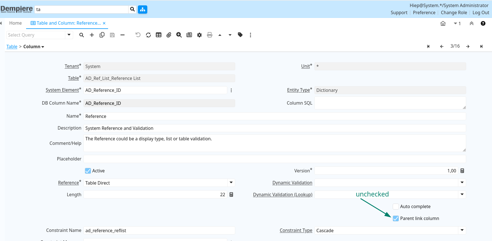
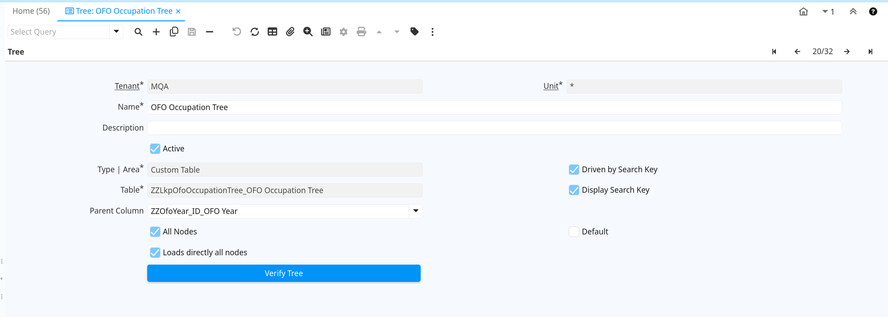

# Update Learner — migration checklist

This document lists cleanup and import steps for learner-related data. It assumes you have a database GUI (for example, DBeaver) and access to the iDempiere application.

## Cleanup: remove old objects (one-time)

Run the following SQL once before applying the LearnerAssessment import to remove obsolete columns and tables:

```
SQL
-- RUN one time at first time apply LearnerAssessment.zip to remove old columns/tables
alter table zzsdf drop column zzperson_id
drop table zzperson
```

## Cleanup: remove previous migration artifacts (one-time)

Run these statements to clear previous migration data and dependent records prior to re-importing reference lists and business tables:

```SQL
DELETE FROM ad_ref_list rl
USING ad_reference ar
WHERE rl.ad_reference_id = ar.ad_reference_id
  AND ar.name IN (
    'ZZLkpNqfLevel',
    'ZZLkpLearnershipType',
    'ZZLkpAetLevel',
    'ZZLkpQualityAssuranceBody',
    'ZZLkpQctoQualificationType',
    'ZZLkpQctoLearnershipType',
    'ZZLkpSkillsProgrammeType',
    'ZZLkpLearningType',
    'ZZLkpModuleType',
    'ZZLkpSkillsProgrammeGrantType',
    'ZZLkpQualificationType',
    'ZZLkpUnitStandardType'
  );

delete from ZZLearnershipUnitStandard;
delete from SkillsProgrammeUnitStandard;

delete from ZZQCTOLearnershipModule;
delete from ZZQCTOSkillsProgrammeModule;

delete from zzqctolearnership;
delete from zzlearnership;
delete from ZZQCTOSkillsProgramme;

delete from  zzlinkassessorskillsprogramme;

delete from ZZSkillsProgramme where ZZSkillsProgramme_ID not in (select ZZSkillsProgramme_ID from c_bp_skillsprogramme);
delete from zzqctoqualification;

delete from  zzlinkassessorqualification;

delete from ZZQualification;
delete from ZZModule;
delete from ZZQCTOModule;
delete from ZZUnitStandard;
```

## System: import reference data

1. Uncheck the "Parent link column" setting for `AD_Reference_ID` on the `AD_Ref_List` table; save and reset the cache.

   
2. Open the "Reference" window and import `reference.csv` via CSV import.
3. Open the "Reference List" window and import `listReference.csv` via CSV import.
4. Re-check the "Parent link column" setting for `AD_Reference_ID`, save and reset the cache.

## Client (MQA): import OFO occupation tree

1. Open the Tree window, set up the OFO occupation tree and run the verify operation.

   
2. Import OFO years using the "OFO Year" window.
3. Import the OFO occupation tree using the "OFO Occupation Tree" window and `LkpOfoOccupation.csv`.

## Business CSV imports

Import these CSV files using their corresponding iDempiere windows (use exported templates from the `ZZ...` windows where available):

- `module.csv` → Module
- `QCTOModule.csv` → QCTOModule
- `UnitStandard.csv` → Unit Standard
- `Qualification.csv` → Qualification
- `qctoQualification.csv` → QCTO Qualification
- `SkillsProgramme.csv` → Skills Programme
- `QCTOSkillsProgramme.csv` → QCTO Skills Programme
- `learnership.csv` → Learnership
- `qctolearnership.csv` → QCTO Learnership
- `QCTOSkillsProgrammeModule.csv` → QCTO Skills Programme Module
- `QCTOLearnershipModule.csv` → QCTO Learnership Module
- `SkillsProgrammeUnitStandard.csv` → Skills Programme UnitStandard
- `LearnershipUnitStandard.csv` → Learnership UnitStandard

## Database GUI: run resolver and resolve references

1. Run the `zzApplyMigrateValues.sql` script to create/update the `zzApplyMigrateValues` function.
2. For each target table, run the resolver and then verify and fix any errors.

   - Run the resolver for a table:

     ```sql
     SELECT zzApplyMigrateValues('<tableName>');
     ```
   - Verify errors:

     ```sql
     select ZZMigrateValues from <tableName> where ZZMigrateValues like '% - ERR:%'
     ```
   - If errors exist, inspect and resolve the underlying data issues.
   - To remove the appended error message while keeping the original payload, run:

     ```sql
     UPDATE ZZQctoModule
     SET ZZMigrateValues = SPLIT_PART(ZZMigrateValues, ' - ERR:', 1)
     WHERE ZZMigrateValues LIKE '% - ERR:%';
     ```
3. Example list of tables to process (run as needed):

```sql
SELECT zzApplyMigrateValues('ZZModule');
select ZZMigrateValues from ZZModule where ZZMigrateValues like '% - ERR:%'

SELECT zzApplyMigrateValues('ZZQctoModule');
select ZZMigrateValues from ZZQctoModule where ZZMigrateValues like '% - ERR:%'

SELECT zzApplyMigrateValues('ZZUnitStandard');
select ZZMigrateValues from ZZUnitStandard where ZZMigrateValues like '% - ERR:%'

SELECT zzApplyMigrateValues('ZZQualification');
select ZZMigrateValues from ZZQualification where ZZMigrateValues like '% - ERR:%'

SELECT zzApplyMigrateValues('zzqctoqualification');
select ZZMigrateValues from zzqctoqualification where ZZMigrateValues like '% - ERR:%'

SELECT zzApplyMigrateValues('ZZSkillsProgramme');
select ZZMigrateValues from ZZSkillsProgramme where ZZMigrateValues like '% - ERR:%'

SELECT zzApplyMigrateValues('ZZQCTOSkillsProgramme');
select ZZMigrateValues from ZZQCTOSkillsProgramme where ZZMigrateValues like '% - ERR:%'

SELECT zzApplyMigrateValues('zzlearnership');
select ZZMigrateValues from zzlearnership where ZZMigrateValues like '% - ERR:%'

SELECT zzApplyMigrateValues('zzqctolearnership');
select ZZMigrateValues from zzqctolearnership where ZZMigrateValues like '% - ERR:%'

SELECT zzApplyMigrateValues('ZZQCTOSkillsProgrammeModule');
select ZZMigrateValues from ZZQCTOSkillsProgrammeModule where ZZMigrateValues like '% - ERR:%'

SELECT zzApplyMigrateValues('ZZQCTOLearnershipModule');
select ZZMigrateValues from ZZQCTOLearnershipModule where ZZMigrateValues like '% - ERR:%'

SELECT zzApplyMigrateValues('ZZSkillsProgrammeUnitStandard');
select ZZMigrateValues from ZZSkillsProgrammeUnitStandard where ZZMigrateValues like '% - ERR:%'

SELECT zzApplyMigrateValues('ZZLearnershipUnitStandard');
select ZZMigrateValues from ZZLearnershipUnitStandard where ZZMigrateValues like '% - ERR:%'
```
